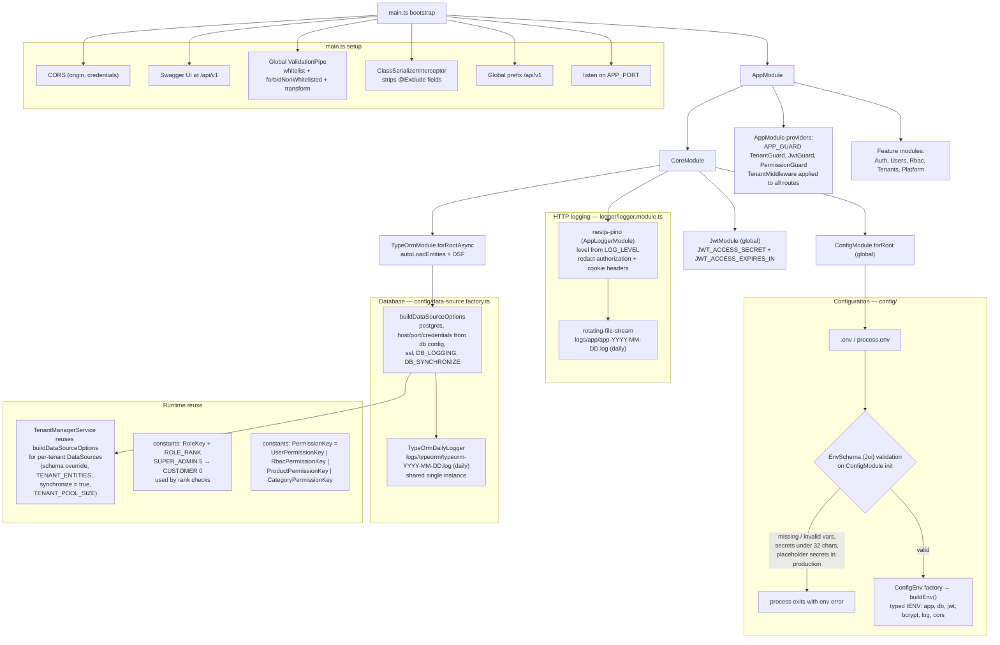

```mermaid
flowchart TD
    START["main.ts bootstrap"] --> APP["AppModule"]
    APP --> CORE["CoreModule"]
    APP --> GUARDSWIRING["AppModule providers:<br/>APP_GUARD TenantGuard, JwtGuard, PermissionGuard<br/>TenantMiddleware applied to all routes"]
    APP --> MODS["Feature modules:<br/>Auth, Users, Rbac, Tenants, Platform"]
    CORE --> CFGMOD["ConfigModule.forRoot (global)"]

    subgraph CFG["Configuration — config/"]
        ENV[".env / process.env"] --> JOI{"EnvSchema (Joi) validation<br/>on ConfigModule init"}
        JOI -->|"missing / invalid vars,<br/>secrets under 32 chars,<br/>placeholder secrets in production"| EXIT["process exits with env error"]
        JOI -->|"valid"| BENV["ConfigEnv factory → buildEnv()<br/>typed IENV: app, db, jwt,<br/>bcrypt, log, cors"]
    end

    CFGMOD --> ENV

    subgraph LOGG["HTTP logging — logger/logger.module.ts"]
        PINO["nestjs-pino (AppLoggerModule)<br/>level from LOG_LEVEL<br/>redact authorization + cookie headers"]
        PINO --> APPLOG["rotating-file-stream<br/>logs/app/app-YYYY-MM-DD.log (daily)"]
    end
    CORE --> PINO

    subgraph DBL["Database — config/data-source.factory.ts"]
        DSF["buildDataSourceOptions<br/>postgres, host/port/credentials from db config,<br/>ssl, DB_LOGGING, DB_SYNCHRONIZE"]
        DSF --> TL["TypeOrmDailyLogger<br/>logs/typeorm/typeorm-YYYY-MM-DD.log (daily)<br/>shared single instance"]
    end
    CORE --> TYPEORM["TypeOrmModule.forRootAsync<br/>autoLoadEntities + DSF"]
    TYPEORM --> DSF
    CORE --> JWTM["JwtModule (global)<br/>JWT_ACCESS_SECRET + JWT_ACCESS_EXPIRES_IN"]

    subgraph MAINSET["main.ts setup"]
        CORS["CORS (origin, credentials)"]
        SWAG["Swagger UI at /api/v1"]
        GPIPE["Global ValidationPipe<br/>whitelist + forbidNonWhitelisted + transform"]
        GINT["ClassSerializerInterceptor<br/>strips @Exclude fields"]
        PREFIX["Global prefix /api/v1"]
        LISTEN["listen on APP_PORT"]
    end
    START --> CORS
    START --> SWAG
    START --> GPIPE
    START --> GINT
    START --> PREFIX
    START --> LISTEN

    subgraph RUNTIME["Runtime reuse"]
        TENDS["TenantManagerService reuses buildDataSourceOptions<br/>for per-tenant DataSources<br/>(schema override, TENANT_ENTITIES, synchronize = true,<br/>TENANT_POOL_SIZE)"]
        RK["constants: RoleKey + ROLE_RANK<br/>SUPER_ADMIN 5 → CUSTOMER 0<br/>used by rank checks"]
        PK["constants: PermissionKey =<br/>UserPermissionKey | RbacPermissionKey |<br/>ProductPermissionKey | CategoryPermissionKey"]
    end
    DSF --> TENDS
```
