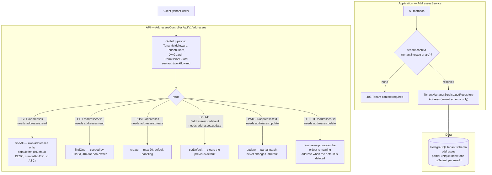
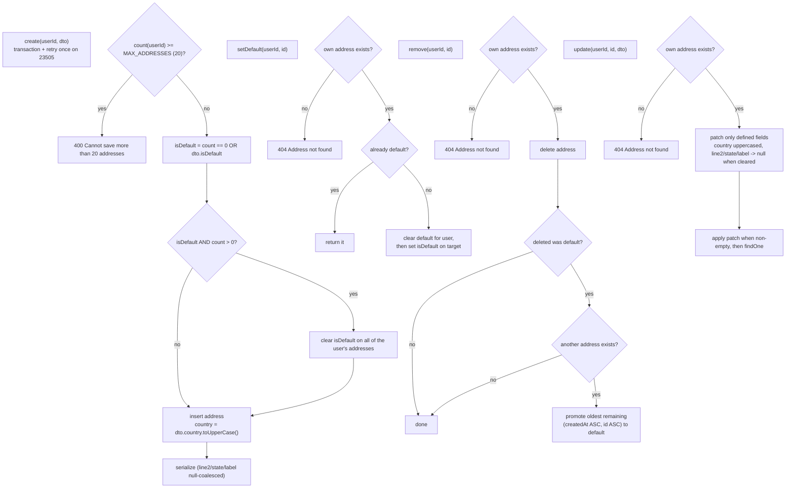

---

`withUniqueRetry` re-runs the whole transaction once when PostgreSQL returns `23505`, so two concurrent requests racing for the single default row settle to one winner instead of failing. All reads and mutations are scoped to `request.user.id`; a user can never see or change another user's address.
