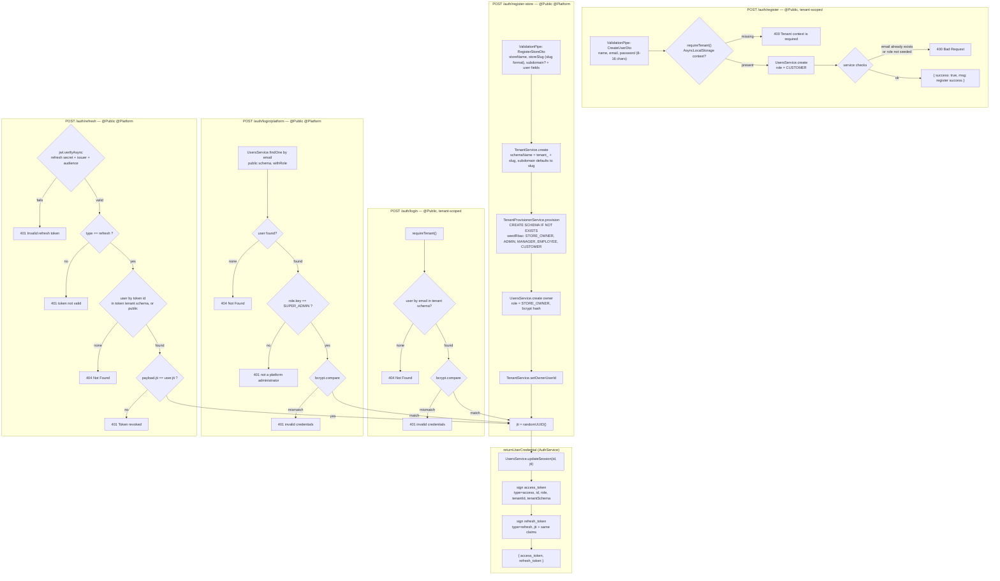

```mermaid
flowchart TD
    Client["Client request<br/>Authorization: Bearer token<br/>x-tenant-id / x-tenant-slug / subdomain host"]

    subgraph MW["TenantMiddleware — applied to all routes by AppModule"]
        M1{"Is API path<br/>/api/v1/* ?"} -->|"no"| MSKIP["next() without tenant context"]
        M1 -->|"yes"| M2{"Tenant resolved from request?"}
        M2 -->|"yes"| M3["req.tenant = tenant<br/>next() runs inside tenantStorage<br/>(AsyncLocalStorage)"]
        M2 -->|"no"| MSKIP
    end

    M3 --> T0
    MSKIP --> T0

    subgraph TG["TenantGuard — APP_GUARD 1"]
        T0{"@Platform() route<br/>or non-API path?"} -->|"yes"| TSKIP["pass"]
        T0 -->|"no"| T1{"req.tenant or<br/>resolveFromRequest() ?"}
        T1 -->|"tenant found"| T2["request.tenant = tenant"]
        T1 -->|"no identifier in request"| T3E["400 Tenant not resolvable<br/>(missing x-tenant-id / x-tenant-slug / subdomain)"]
        T1 -->|"identifier sent, lookup failed"| T3N["404 Tenant not found"]
    end

    T2 --> J0
    TSKIP --> J0

    subgraph JG["JwtGuard — APP_GUARD 2"]
        J0{"@Public() route?"} -->|"yes"| JSKIP["skip authentication"]
        J0 -->|"no"| J1{"Bearer token present?"}
        J1 -->|"no"| J1E["401 No token provided"]
        J1 -->|"yes"| J2{"JWT verify<br/>access secret + issuer + audience"}
        J2 -->|"invalid or expired"| J2E["401 Invalid token"]
        J2 -->|"valid"| J3{"payload.type == access ?"}
        J3 -->|"no"| J3E["401 Unauthorized"]
        J3 -->|"yes"| J4{"Route scope"}
        J4 -->|"@Platform() route"| JP0{"Token carries tenant claims?"}
        JP0 -->|"yes"| JPE["403 Platform routes require a platform token"]
        JP0 -->|"no"| JPU["UsersService.findOne<br/>public schema, with role + permissions"]
        J4 -->|"tenant route"| JR0{"Token carries tenant claims?"}
        JR0 -->|"no"| JR0E["403 Tenant-scoped token required"]
        JR0 -->|"yes"| JR1{"Tenant context resolved?"}
        JR1 -->|"no"| JR1E["403 Tenant context is required"]
        JR1 -->|"yes"| JR2{"resolved schemaName equals token tenantSchema ?"}
        JR2 -->|"no"| JR2E["403 Token does not belong to this tenant"]
        JR2 -->|"yes"| JRT["UsersService.findOne<br/>tenant schema, with role + permissions"]
        JPU --> JU{"User found?"}
        JRT --> JU
        JU -->|"no"| JUE["404 User not found"]
        JU -->|"yes"| JATT["request.user = id, name, email, role<br/>permissions = direct + role permissions (deduped)<br/>request.tenant = resolved tenant"]
    end

    JATT --> G0
    JSKIP --> G0

    subgraph PG["PermissionGuard — APP_GUARD 3"]
        G0{"@Public() route?"} -->|"yes"| GSKIP["pass"]
        G0 -->|"no"| G1{"request.user set?"}
        G1 -->|"no"| G1E["403 User not authenticated"]
        G1 -->|"yes"| G2{"@Roles() requires SUPER_ADMIN<br/>and user is not SUPER_ADMIN ?"}
        G2 -->|"yes"| G2E["403 You are not allowed<br/>to access this resource"]
        G2 -->|"no"| G3{"user is SUPER_ADMIN ?"}
        G3 -->|"yes"| GSKIP
        G3 -->|"no"| G4{"@Roles() set and<br/>user role not in list ?"}
        G4 -->|"yes"| G4E["403 You are not allowed<br/>to access this resource"]
        G4 -->|"no"| G5{"@Permissions() set and<br/>user does not own all of them ?"}
        G5 -->|"yes"| G5E["403 You are not allowed<br/>to access this resource"]
        G5 -->|"no"| GSKIP
    end

    GSKIP --> VP{"ValidationPipe<br/>whitelist + forbidNonWhitelisted + transform"}
    VP -->|"invalid or unknown fields"| VPE["400 Bad Request"]
    VP -->|"valid"| CTRL["Controller handler"]
    CTRL --> CSI["ClassSerializerInterceptor<br/>strips @Exclude fields (password, jti)"]
    CSI --> RESP["Response"]
```

```mermaid
flowchart TD
    subgraph REG["POST /auth/register — @Public, tenant-scoped"]
        R0["ValidationPipe: CreateUserDto<br/>name, email, password (8-16 chars)"] --> R1{"requireTenant()<br/>AsyncLocalStorage context?"}
        R1 -->|"missing"| R1E["400 Tenant context is required"]
        R1 -->|"present"| R2["UsersService.create<br/>role = CUSTOMER"]
        R2 --> R3{"service checks"}
        R3 -->|"email already exists<br/>or role not seeded"| R3E["400 Bad Request"]
        R3 -->|"ok"| R4["{ success: true, msg: register success }"]
    end

    subgraph RS["POST /auth/register-store — @Public @Platform"]
        S0["ValidationPipe: RegisterStoreDto<br/>storeName, storeSlug (slug format), subdomain? + user fields"] --> S1["TenantService.create<br/>schemaName = tenant_ + slug, subdomain defaults to slug"]
        S1 --> S2["TenantProvisionerService.provision<br/>CREATE SCHEMA IF NOT EXISTS<br/>seedRbac: STORE_OWNER, ADMIN, MANAGER, EMPLOYEE, CUSTOMER"]
        S2 --> S3["UsersService.create owner<br/>role = STORE_OWNER, bcrypt hash"]
        S3 --> S4["TenantService.setOwnerUserId"]
        S4 --> CRED
    end

    subgraph LI["POST /auth/login — @Public, tenant-scoped"]
        L1["requireTenant()"] --> L2{"user by email in tenant schema?"}
        L2 -->|"none"| L2E["404 Not Found"]
        L2 -->|"found"| L3{"bcrypt.compare"}
        L3 -->|"mismatch"| L3E["401 invalid credentials"]
        L3 -->|"match"| CRED
    end

    subgraph LP["POST /auth/login/platform — @Public @Platform"]
        P1["UsersService.findOne by email<br/>public schema, withRole"] --> P2{"user found?"}
        P2 -->|"none"| P2E["404 Not Found"]
        P2 -->|"found"| P3{"role.key == SUPER_ADMIN ?"}
        P3 -->|"no"| P3E["401 not a platform administrator"]
        P3 -->|"yes"| P4{"bcrypt.compare"}
        P4 -->|"mismatch"| P4E["401 invalid credentials"]
        P4 -->|"match"| CRED
    end

    subgraph RF["POST /auth/refresh — @Public @Platform"]
        F1{"jwt.verifyAsync<br/>refresh secret + issuer + audience"} -->|"fails"| F1E["401 Invalid refresh token"]
        F1 -->|"valid"| F2{"type == refresh ?"}
        F2 -->|"no"| F2E["401 token not valid"]
        F2 -->|"yes"| F3{"user by token id<br/>in token tenant schema, or public"}
        F3 -->|"none"| F3E["404 Not Found"]
        F3 -->|"found"| F4{"payload.jti == user.jti ?"}
        F4 -->|"no"| F4E["401 Token revoked"]
        F4 -->|"yes"| CRED
    end

    subgraph CR["returnUserCredential (AuthService)"]
        CRED["jti = randomUUID()"] --> C1["UsersService.updateSession(id, jti)"]
        C1 --> C2["sign access_token<br/>type=access, id, role, tenantId, tenantSchema"]
        C2 --> C3["sign refresh_token<br/>type=refresh, jti + same claims"]
        C3 --> OUT["{ access_token, refresh_token }"]
    end
```
