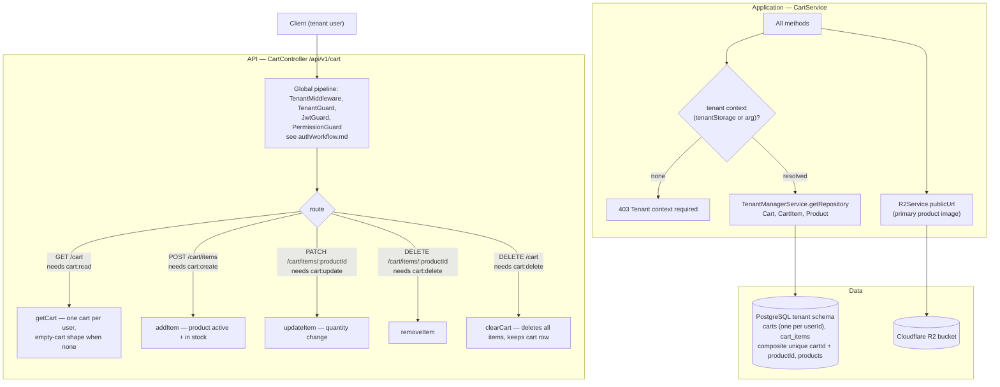
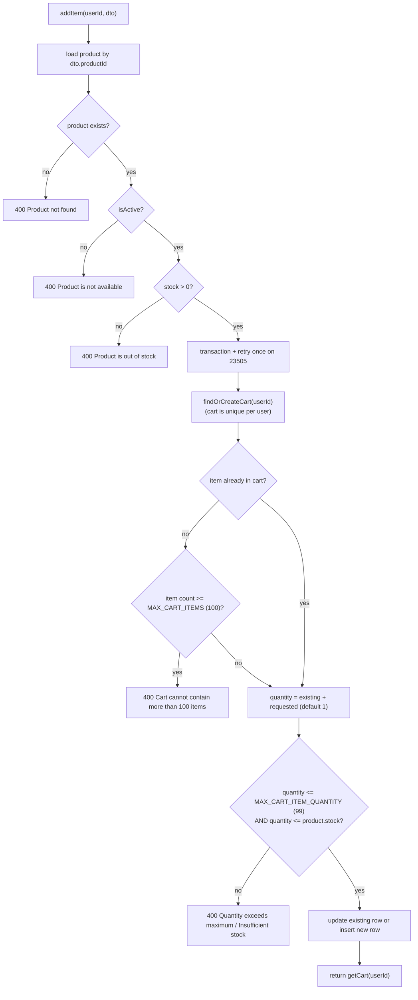
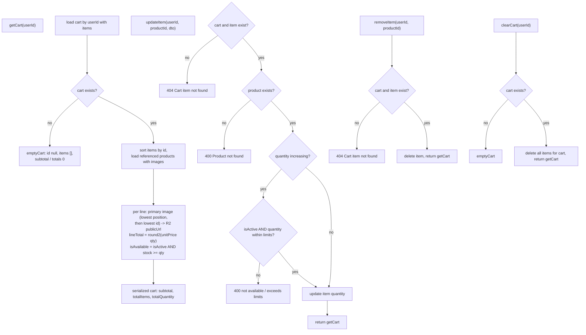

```mermaid
flowchart TD
    Client["Client (tenant user)"] --> GUARDS["Global pipeline: TenantMiddleware, TenantGuard,<br/>JwtGuard, PermissionGuard<br/>see auth/workflow.md"]

    subgraph API["API — CartController /api/v1/cart"]
        GUARDS --> RO{"route"}
        RO -->|"GET /cart<br/>needs cart:read"| GC["getCart — one cart per user,<br/>empty-cart shape when none"]
        RO -->|"POST /cart/items<br/>needs cart:create"| AI["addItem — product active + in stock"]
        RO -->|"PATCH /cart/items/:productId<br/>needs cart:update"| UI["updateItem — quantity change"]
        RO -->|"DELETE /cart/items/:productId<br/>needs cart:delete"| RI["removeItem"]
        RO -->|"DELETE /cart<br/>needs cart:delete"| CL["clearCart — deletes all items, keeps cart row"]
    end

    subgraph APP["Application — CartService"]
        SVC["All methods"] --> TRT{"tenant context<br/>(tenantStorage or arg)?"}
        TRT -->|"none"| TRTE["403 Tenant context required"]
        TRT -->|"resolved"| TM["TenantManagerService.getRepository<br/>Cart, CartItem, Product"]
        SVC --> R2S["R2Service.publicUrl<br/>(primary product image)"]
    end

    subgraph DATA["Data"]
        TM --> TDB[("PostgreSQL tenant schema<br/>carts (one per userId), cart_items<br/>composite unique cartId + productId, products")]
        R2S --> R2[("Cloudflare R2 bucket")]
    end
```

---

```mermaid
flowchart TD
    AI["addItem(userId, dto)"] --> A0["load product by dto.productId"]
    A0 --> A1{"product exists?"} -->|"no"| A1E["400 Product not found"]
    A1 -->|"yes"| A2{"isActive?"} -->|"no"| A2E["400 Product is not available"]
    A2 -->|"yes"| A3{"stock > 0?"} -->|"no"| A3E["400 Product is out of stock"]
    A3 -->|"yes"| A4["transaction + retry once on 23505"]
    A4 --> A5["findOrCreateCart(userId)<br/>(cart is unique per user)"]
    A5 --> A6{"item already in cart?"}
    A6 -->|"no"| A7{"item count >= MAX_CART_ITEMS (100)?"} -->|"yes"| A7E["400 Cart cannot contain more than 100 items"]
    A6 -->|"yes"| A8
    A7 -->|"no"| A8["quantity = existing + requested (default 1)"]
    A8 --> A9{"quantity <= MAX_CART_ITEM_QUANTITY (99)<br/>AND quantity <= product.stock?"}
    A9 -->|"no"| A9E["400 Quantity exceeds maximum / Insufficient stock"]
    A9 -->|"yes"| A10["update existing row or insert new row"]
    A10 --> A11["return getCart(userId)"]
```

---

```mermaid
flowchart TD
    GC["getCart(userId)"]
        G0["load cart by userId with items"] --> G1{"cart exists?"}
        G1 -->|"no"| G2["emptyCart: id null, items [],<br/>subtotal / totals 0"]
        G1 -->|"yes"| G3["sort items by id,<br/>load referenced products with images"]
        G3 --> G4["per line: primary image (lowest position,<br/>then lowest id) -> R2 publicUrl<br/>lineTotal = round2(unitPrice qty)<br/>isAvailable = isActive AND stock >= qty"]
        G4 --> G5["serialized cart: subtotal, totalItems, totalQuantity"]

    UI["updateItem(userId, productId, dto)"]
        U1{"cart and item exist?"} -->|"no"| U1E["404 Cart item not found"]
        U1 -->|"yes"| U2{"product exists?"} -->|"no"| U2E["400 Product not found"]
        U2 -->|"yes"| U3{"quantity increasing?"}
        U3 -->|"yes"| U4{"isActive AND quantity within limits?"} -->|"no"| U4E["400 not available / exceeds limits"]
        U3 -->|"no"| U5["update item quantity"]
        U4 -->|"yes"| U5
        U5 --> U6["return getCart"]

    RI["removeItem(userId, productId)"] --> R1{"cart and item exist?"} -->|"no"| R1E["404 Cart item not found"]
    R1 -->|"yes"| R2["delete item, return getCart"]

    CL["clearCart(userId)"] --> C1{"cart exists?"} -->|"no"| C2["emptyCart"]
    C1 -->|"yes"| C3["delete all items for cart, return getCart"]
```

Cart reads never mutate stock. Stock, the 100-line cap, and the quantity cap are only validated here; stock is re-checked and decremented atomically at checkout (`orders/workflow.md`).
