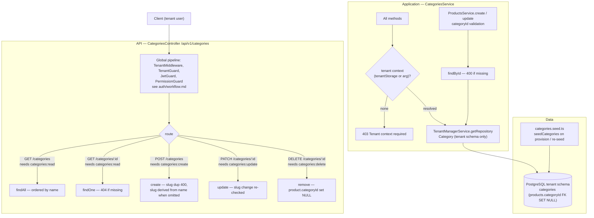
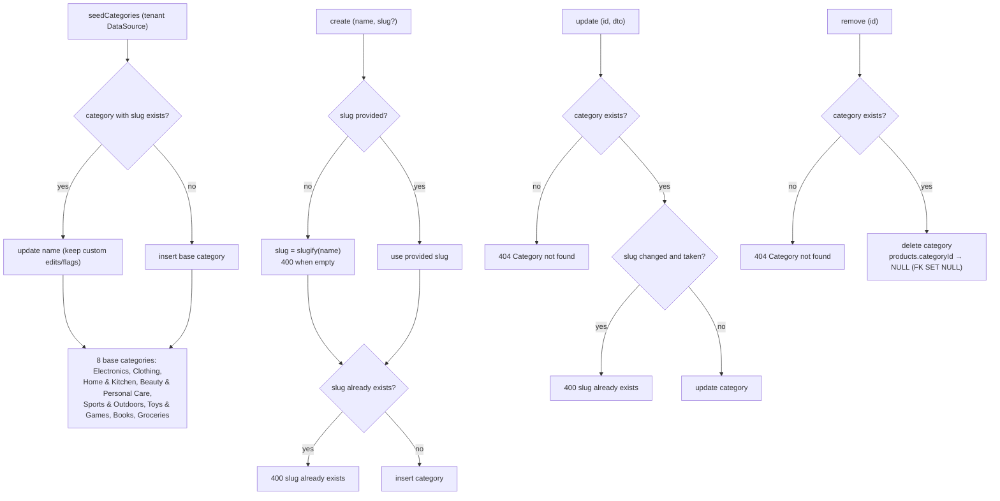

```mermaid
flowchart TD
    Client["Client (tenant user)"] --> GUARDS["Global pipeline: TenantMiddleware, TenantGuard,<br/>JwtGuard, PermissionGuard<br/>see auth/workflow.md"]

    subgraph API["API — CategoriesController /api/v1/categories"]
        GUARDS --> CRO{"route"}
        CRO -->|"GET /categories<br/>needs categories:read"| CFA["findAll — ordered by name"]
        CRO -->|"GET /categories/:id<br/>needs categories:read"| CFO["findOne — 404 if missing"]
        CRO -->|"POST /categories<br/>needs categories:create"| CC["create — slug dup 400,<br/>slug derived from name when omitted"]
        CRO -->|"PATCH /categories/:id<br/>needs categories:update"| CU["update — slug change re-checked"]
        CRO -->|"DELETE /categories/:id<br/>needs categories:delete"| CD["remove — product.categoryId set NULL"]
    end

    subgraph APP["Application — CategoriesService"]
        SVC["All methods"] --> TRT{"tenant context<br/>(tenantStorage or arg)?"}
        TRT -->|"none"| TRTE["403 Tenant context required"]
        TRT -->|"resolved"| TM["TenantManagerService.getRepository<br/>Category (tenant schema only)"]
        P["ProductsService.create / update<br/>categoryId validation"] --> FIND["findById — 400 if missing"]
        FIND --> TM
    end

    subgraph DATA["Data"]
        TM --> TDB[("PostgreSQL tenant schema<br/>categories (products.categoryId FK SET NULL)")]
        SEEDCAT["categories.seed.ts<br/>seedCategories on provision / re-seed"] --> TDB
    end
```

---

```mermaid
flowchart TD
    SEED["seedCategories (tenant DataSource)"] --> SC1{"category with slug exists?"}
    SC1 -->|"yes"| SC2["update name (keep custom edits/flags)"]
    SC1 -->|"no"| SC3["insert base category"]
    SC2 --> SCD["8 base categories: Electronics, Clothing,<br/>Home & Kitchen, Beauty & Personal Care,<br/>Sports & Outdoors, Toys & Games, Books, Groceries"]
    SC3 --> SCD

    CREATE["create (name, slug?)"] --> C0{"slug provided?"}
    C0 -->|"no"| C1["slug = slugify(name)<br/>400 when empty"]
    C0 -->|"yes"| C2["use provided slug"]
    C1 --> C3
    C2 --> C3
    C3{"slug already exists?"} -->|"yes"| C3E["400 slug already exists"]
    C3 -->|"no"| C4["insert category"]

    UPDATE["update (id, dto)"] --> U1{"category exists?"} -->|"no"| U1E["404 Category not found"]
    U1 -->|"yes"| U2{"slug changed and taken?"}
    U2 -->|"yes"| U2E["400 slug already exists"]
    U2 -->|"no"| U3["update category"]

    REMOVE["remove (id)"] --> D1
    D1{"category exists?"} -->|"no"| D1E["404 Category not found"]
    D1 -->|"yes"| D2["delete category<br/>products.categoryId → NULL (FK SET NULL)"]
```
