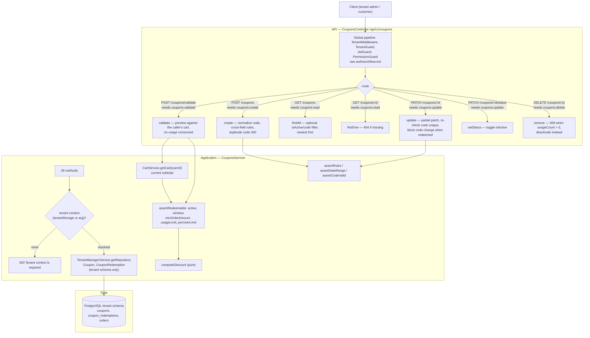
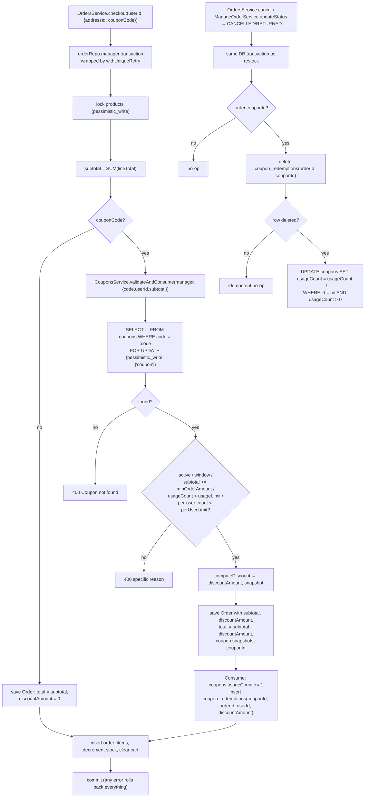

---

Rules (`coupons.service.ts`, `coupon-discount.ts`):
- Code is stored normalized (`trim().toUpperCase()`), unique per tenant schema, regex `^[A-Z0-9][A-Z0-9_-]*$`, max 64.
- `PERCENTAGE`: `0 < value <= 100`, optional `maxDiscountAmount` cap; `FIXED_AMOUNT`: `value > 0`, `maxDiscountAmount` rejected.
- Discount applies to `subtotal` only, rounded to cents and clamped to `[0, subtotal]`; `total` is never negative.
- MVP allows one coupon per order; consumption is atomic with checkout (`usageCount` counter + `CouponRedemption` row), so a failed checkout restores both automatically.
- `POST /coupons/validate` previews against the caller's cart and never consumes usage.
