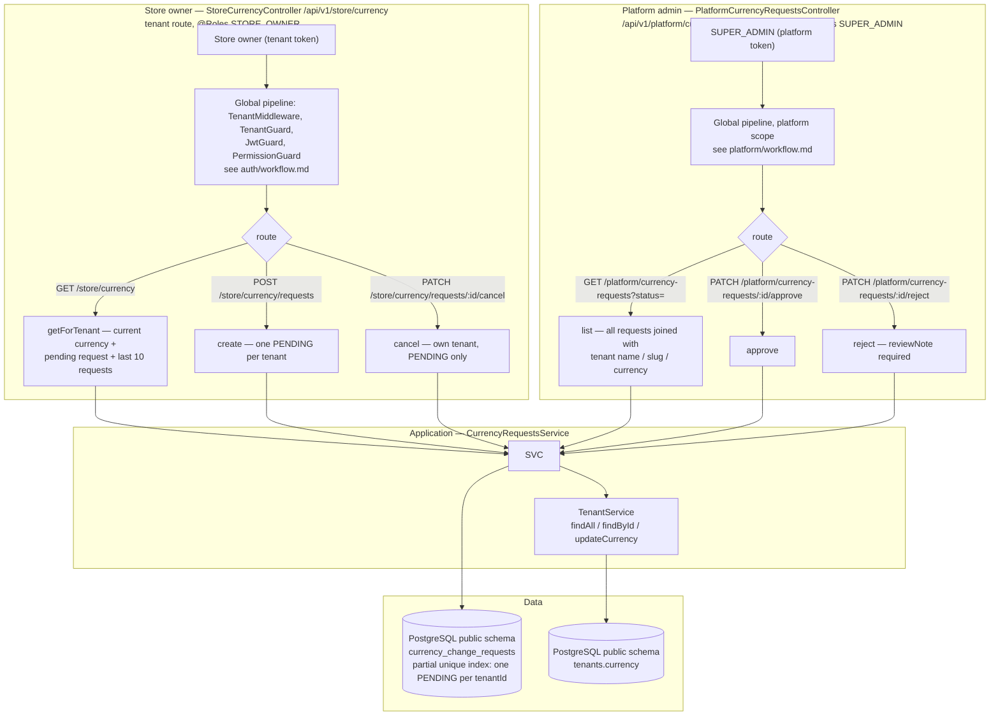
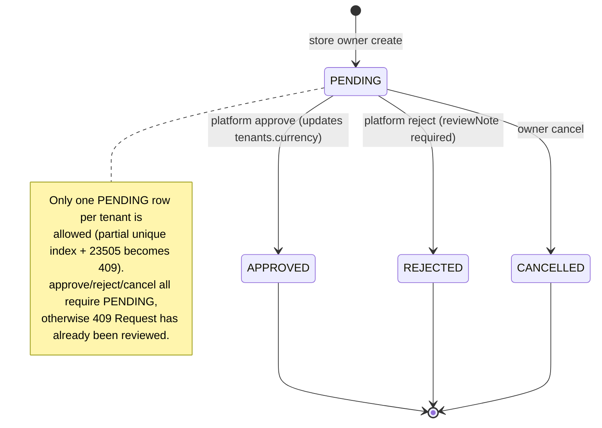
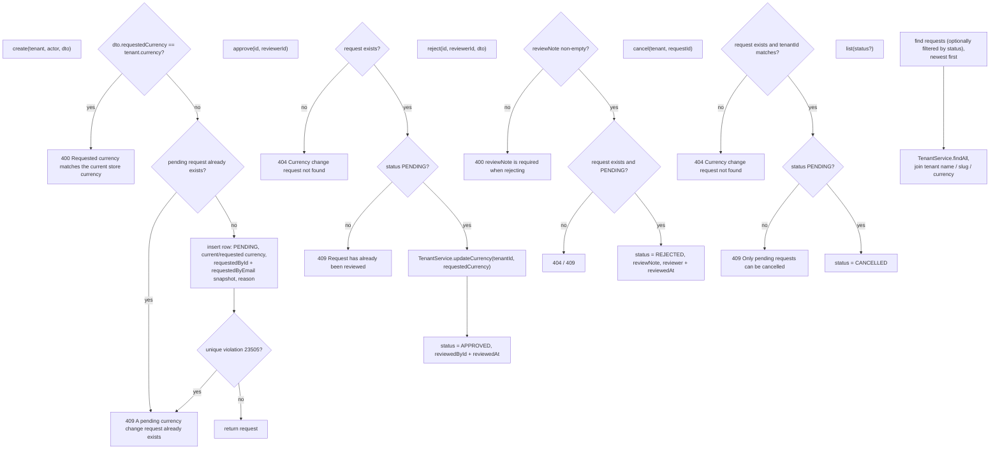

---

---

Changing a store's live currency requires platform approval: the store owner files a request, a SUPER_ADMIN applies it. The platform list endpoint is the only place that spans tenants; the store endpoints are always scoped to `req.tenant`.
