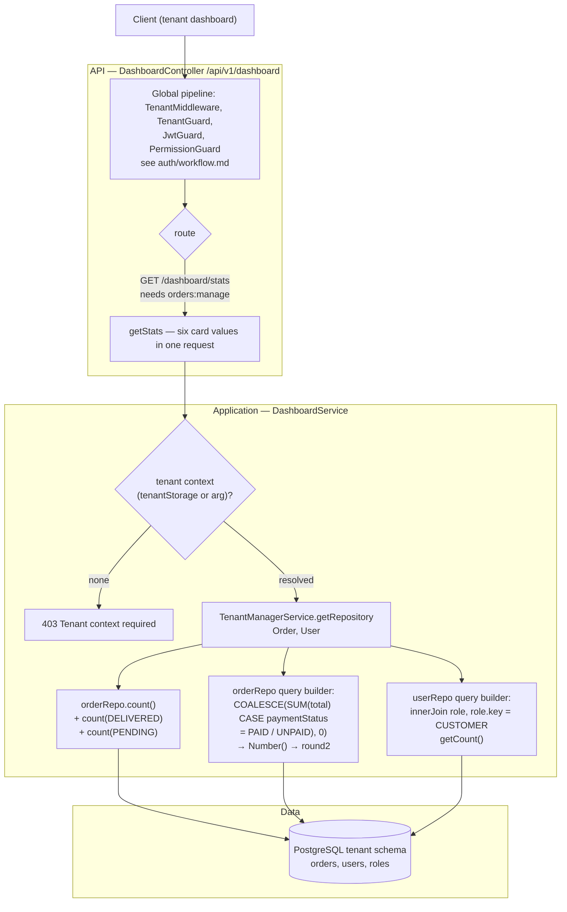
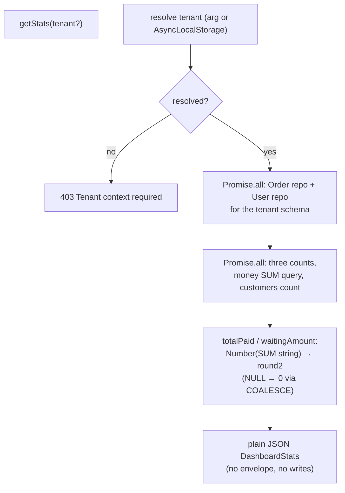

```mermaid
flowchart TD
    Client["Client (tenant dashboard)"] --> GUARDS["Global pipeline: TenantMiddleware, TenantGuard,<br/>JwtGuard, PermissionGuard<br/>see auth/workflow.md"]

    subgraph API["API — DashboardController /api/v1/dashboard"]
        GUARDS --> RO{"route"}
        RO -->|"GET /dashboard/stats<br/>needs orders:manage"| GS["getStats — six card values in one request"]
    end

    subgraph APP["Application — DashboardService"]
        GS --> TRT{"tenant context<br/>(tenantStorage or arg)?"}
        TRT -->|"none"| TRTE["403 Tenant context required"]
        TRT -->|"resolved"| TM["TenantManagerService.getRepository<br/>Order, User"]
        TM --> CNT["orderRepo.count()<br/>+ count(DELIVERED)<br/>+ count(PENDING)"]
        TM --> SUM["orderRepo query builder:<br/>COALESCE(SUM(total) CASE paymentStatus<br/>= PAID / UNPAID), 0)<br/>→ Number() → round2"]
        TM --> CUS["userRepo query builder:<br/>innerJoin role, role.key = CUSTOMER<br/>getCount()"]
    end

    subgraph DATA["Data"]
        CNT --> TDB[("PostgreSQL tenant schema<br/>orders, users, roles")]
        SUM --> TDB
        CUS --> TDB
    end
```

---

```mermaid
flowchart TD
    GS["getStats(tenant?)"]
        G0["resolve tenant (arg or AsyncLocalStorage)"] --> G1{"resolved?"}
        G1 -->|"no"| G1E["403 Tenant context required"]
        G1 -->|"yes"| G2["Promise.all: Order repo + User repo<br/>for the tenant schema"]
        G2 --> G3["Promise.all: three counts,<br/>money SUM query, customers count"]
        G3 --> G4["totalPaid / waitingAmount:<br/>Number(SUM string) → round2<br/>(NULL → 0 via COALESCE)"]
        G4 --> G5["plain JSON DashboardStats<br/>(no envelope, no writes)"]
```
