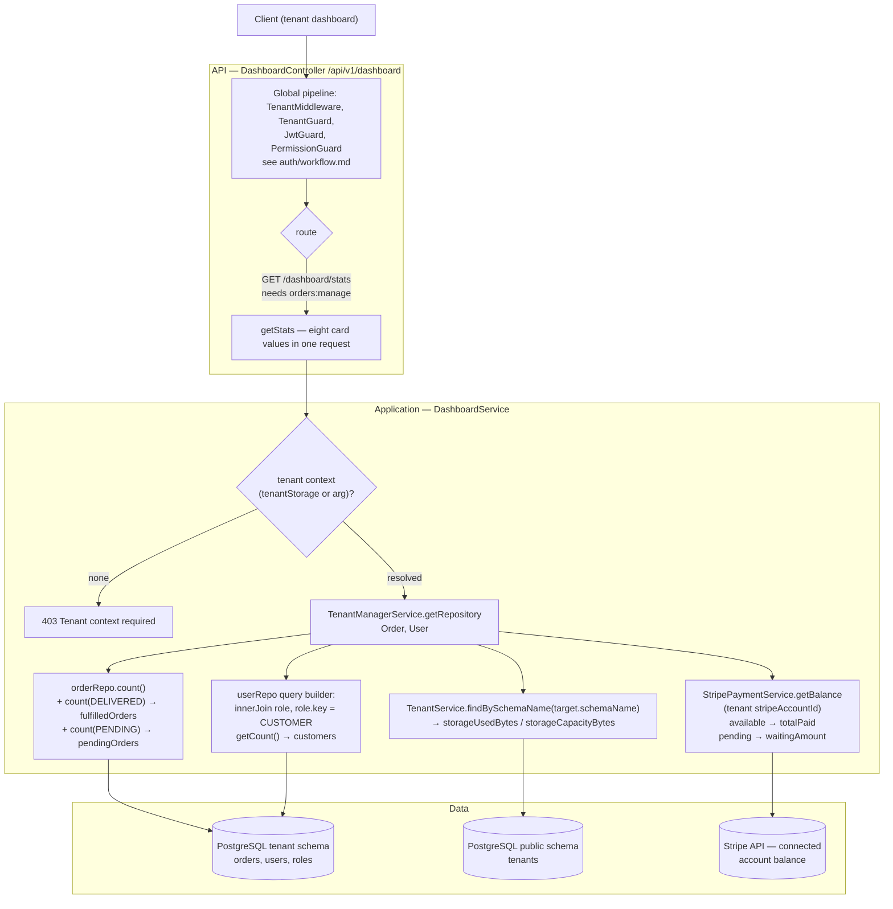
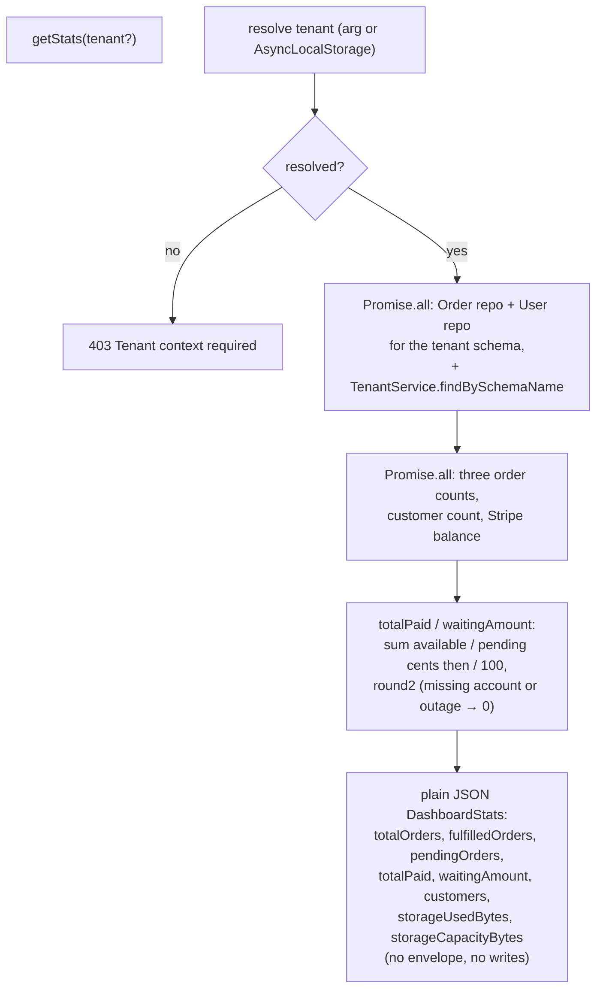

---

Stripe failures never fail the endpoint: a missing/disconnected account or a Stripe outage degrades `totalPaid` and `waitingAmount` to `0` and logs a warning, so the rest of the dashboard still renders.
