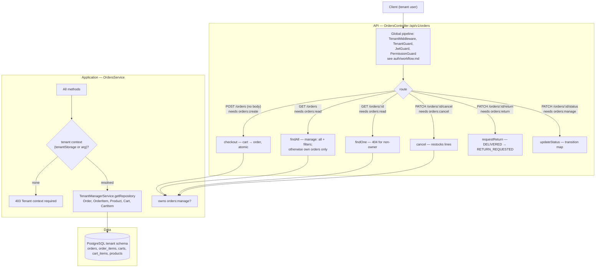
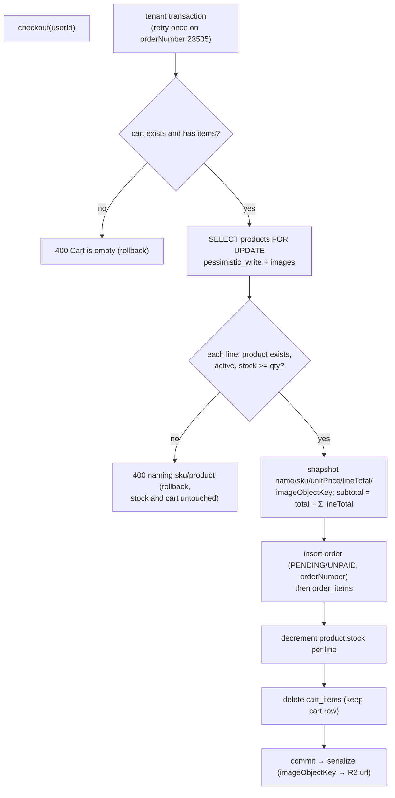
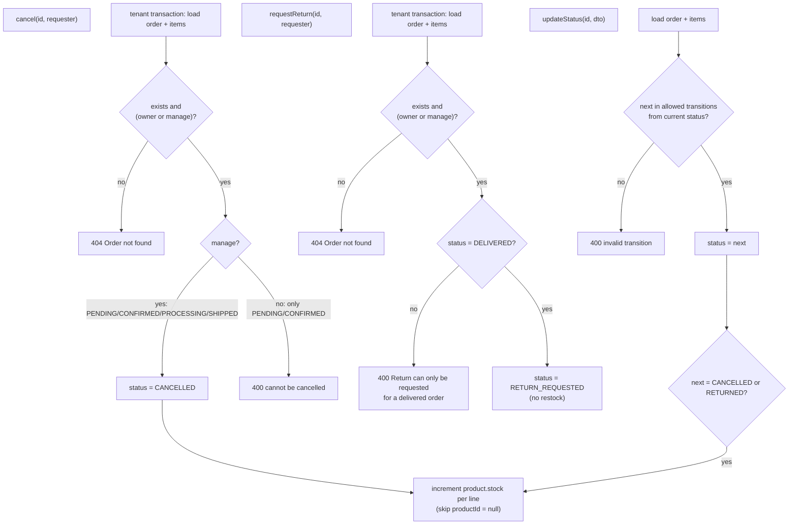

```mermaid
flowchart TD
    Client["Client (tenant user)"] --> GUARDS["Global pipeline: TenantMiddleware, TenantGuard,<br/>JwtGuard, PermissionGuard<br/>see auth/workflow.md"]

    subgraph API["API — OrdersController /api/v1/orders"]
        GUARDS --> RO{"route"}
        RO -->|"POST /orders (no body)<br/>needs orders:create"| CO["checkout — cart → order, atomic"]
        RO -->|"GET /orders<br/>needs orders:read"| FA["findAll — manage: all + filters;<br/>otherwise own orders only"]
        RO -->|"GET /orders/:id<br/>needs orders:read"| FO["findOne — 404 for non-owner"]
        RO -->|"PATCH /orders/:id/cancel<br/>needs orders:cancel"| CA["cancel — restocks lines"]
        RO -->|"PATCH /orders/:id/return<br/>needs orders:return"| RR["requestReturn — DELIVERED → RETURN_REQUESTED"]
        RO -->|"PATCH /orders/:id/status<br/>needs orders:manage"| US["updateStatus — transition map"]
    end

    subgraph APP["Application — OrdersService"]
        SVC["All methods"] --> TRT{"tenant context<br/>(tenantStorage or arg)?"}
        TRT -->|"none"| TRTE["403 Tenant context required"]
        TRT -->|"resolved"| TM["TenantManagerService.getRepository<br/>Order, OrderItem, Product, Cart, CartItem"]
        CO --> CAN["owns orders:manage?"]
        FA --> CAN
        FO --> CAN
        CA --> CAN
    end

    subgraph DATA["Data"]
        TM --> TDB[("PostgreSQL tenant schema<br/>orders, order_items, carts, cart_items, products")]
    end
```

---

```mermaid
flowchart TD
    CO["checkout(userId)"]
        C0["tenant transaction<br/>(retry once on orderNumber 23505)"] --> C1{"cart exists and has items?"}
        C1 -->|"no"| C1E["400 Cart is empty (rollback)"]
        C1 -->|"yes"| C2["SELECT products FOR UPDATE<br/>pessimistic_write + images"]
        C2 --> C3{"each line: product exists,<br/>active, stock >= qty?"}
        C3 -->|"no"| C3E["400 naming sku/product (rollback,<br/>stock and cart untouched)"]
        C3 -->|"yes"| C4["snapshot name/sku/unitPrice/lineTotal/<br/>imageObjectKey; subtotal = total = Σ lineTotal"]
        C4 --> C5["insert order (PENDING/UNPAID, orderNumber)<br/>then order_items"]
        C5 --> C6["decrement product.stock per line"]
        C6 --> C7["delete cart_items (keep cart row)"]
        C7 --> C8["commit → serialize (imageObjectKey → R2 url)"]
```

---

```mermaid
flowchart TD
    CA["cancel(id, requester)"]
        A0["tenant transaction: load order + items"] --> A1{"exists and<br/>(owner or manage)?"}
        A1 -->|"no"| A1E["404 Order not found"]
        A1 -->|"yes"| A2{"manage?"}
        A2 -->|"yes: PENDING/CONFIRMED/PROCESSING/SHIPPED"| A3["status = CANCELLED"]
        A2 -->|"no: only PENDING/CONFIRMED"| A2E["400 cannot be cancelled"]
        A3 --> A4["increment product.stock per line<br/>(skip productId = null)"]

    RR["requestReturn(id, requester)"]
        R0["tenant transaction: load order + items"] --> R1{"exists and<br/>(owner or manage)?"}
        R1 -->|"no"| R1E["404 Order not found"]
        R1 -->|"yes"| R2{"status = DELIVERED?"}
        R2 -->|"no"| R2E["400 Return can only be requested<br/>for a delivered order"]
        R2 -->|"yes"| R3["status = RETURN_REQUESTED<br/>(no restock)"]

    US["updateStatus(id, dto)"]
        U0["load order + items"] --> U1{"next in allowed transitions<br/>from current status?"}
        U1 -->|"no"| U1E["400 invalid transition"]
        U1 -->|"yes"| U2["status = next"]
        U2 --> U3{"next = CANCELLED or RETURNED?"} -->|"yes"| A4
```
