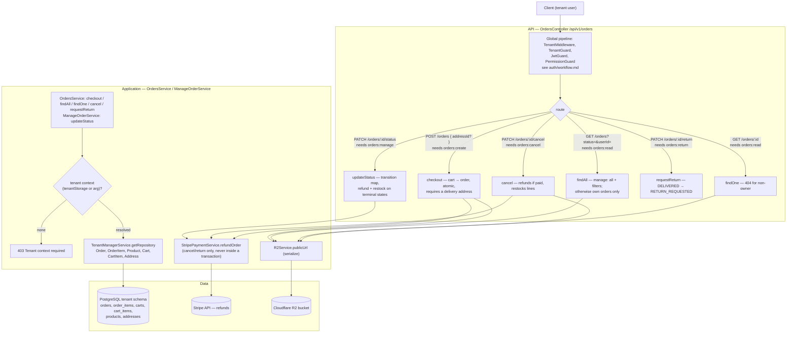
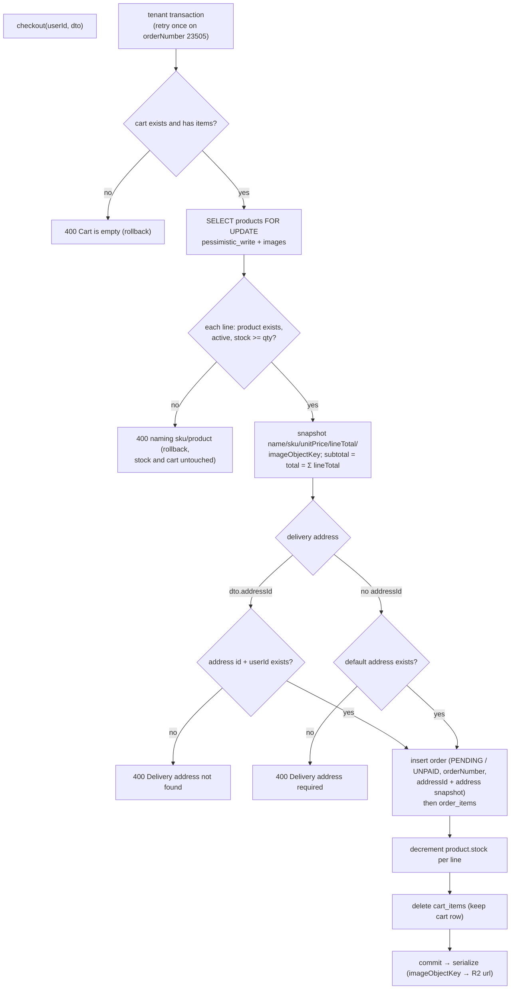
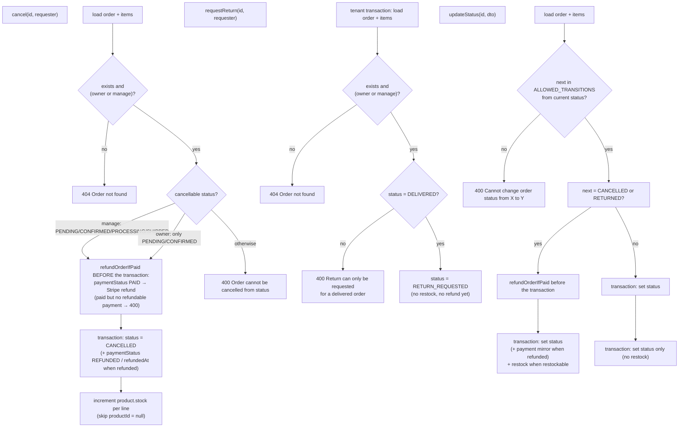

---

---

Order status transitions (`ManageOrderService.ALLOWED_TRANSITIONS`):

| From | Allowed next |
| --- | --- |
| `PENDING` | `CONFIRMED`, `CANCELLED` |
| `CONFIRMED` | `PROCESSING`, `CANCELLED` |
| `PROCESSING` | `SHIPPED`, `CANCELLED` |
| `SHIPPED` | `DELIVERED`, `CANCELLED` |
| `DELIVERED` | `RETURN_REQUESTED` |
| `RETURN_REQUESTED` | `RETURNED`, `DELIVERED` |
| `RETURNED`, `CANCELLED` | terminal |

Entering `CANCELLED` or `RETURNED` restocks every line and refunds the order when `paymentStatus` is `PAID`. Refunds always run before the status transaction so a paid order is never cancelled without the customer's money coming back.
