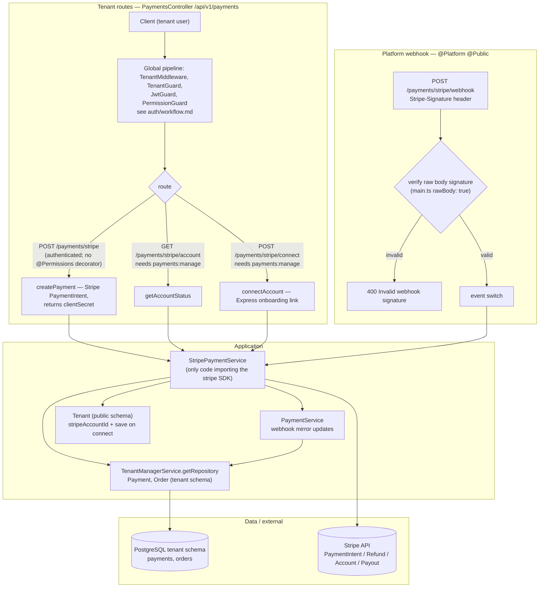
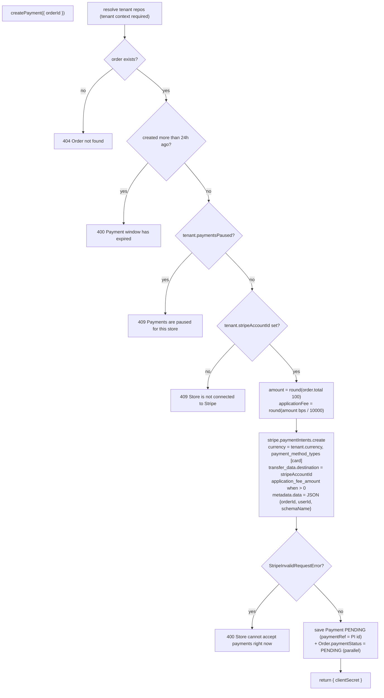
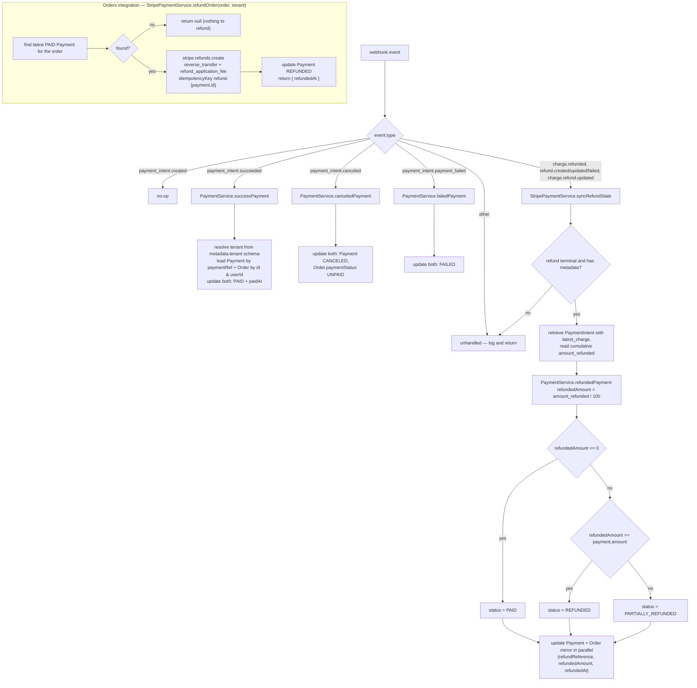

---

---

Notes:

- `POST /payments/stripe` has no `@Permissions` decorator, so any authenticated tenant user passes the guard; the order lookup is by `orderId` alone, not by `order.userId`.
- `refundOrder` is called by `OrdersService.cancel` and `ManageOrderService.updateStatus` **before** the DB transaction, so Stripe is never invoked inside a transaction.
- `PaymentService.canceledPayment` / `failedPayment` write `canceledAt` / `failedAt`; those columns are not declared on the `Payment` (or `Order`) entity today, so treat them as intended state fields rather than persisted ones.
