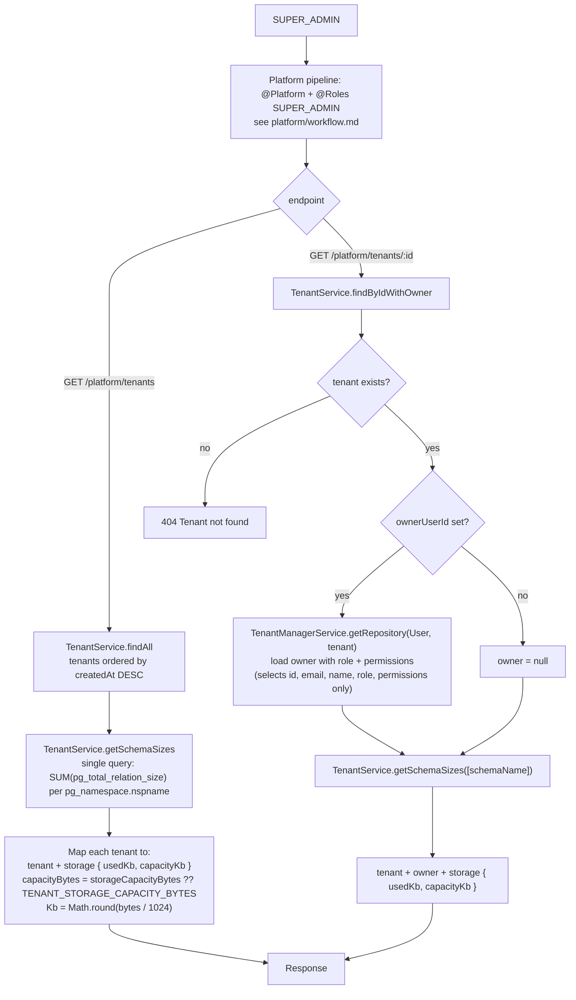

```mermaid
flowchart TD
    Client["SUPER_ADMIN"] --> GUARD["Platform pipeline: @Platform + @Roles SUPER_ADMIN<br/>see platform/workflow.md"]
    GUARD --> OP{"endpoint"}

    OP -->|"GET /platform/tenants"| L["TenantService.findAll<br/>tenants ordered by createdAt DESC"]
    L --> LS["TenantService.getSchemaSizes<br/>single query: SUM(pg_total_relation_size) per pg_namespace.nspname"]
    LS --> LR["Map each tenant to:<br/>tenant + storage { usedKb, capacityKb }<br/>capacityBytes = storageCapacityBytes ?? TENANT_STORAGE_CAPACITY_BYTES<br/>Kb = Math.round(bytes / 1024)"]
    LR --> RESP["Response"]

    OP -->|"GET /platform/tenants/:id"| F["TenantService.findByIdWithOwner"]
    F --> F1{"tenant exists?"}
    F1 -->|"no"| E404["404 Tenant not found"]
    F1 -->|"yes"| F2{"ownerUserId set?"}
    F2 -->|"yes"| F3["TenantManagerService.getRepository(User, tenant)<br/>load owner with role + permissions<br/>(selects id, email, name, role, permissions only)"]
    F2 -->|"no"| F4["owner = null"]
    F3 --> FS["TenantService.getSchemaSizes([schemaName])"]
    F4 --> FS
    FS --> OUT["tenant + owner + storage { usedKb, capacityKb }"]
    OUT --> RESP
```
