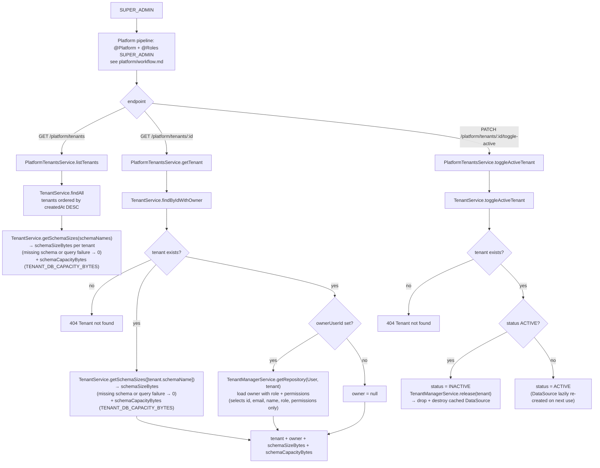

`TenantService.getSchemaSizes()` (single `SUM(pg_total_relation_size)` query over all requested schemas) is wired into these platform endpoints as `schemaSizeBytes`: `listTenants` fetches every tenant then resolves all schema sizes in one call, and `getTenant` resolves the single tenant's schema. A missing schema entry or a failed query degrades `schemaSizeBytes` to `0` and logs a warning, so the endpoints keep rendering. `schemaCapacityBytes` accompanies it, read from `TENANT_DB_CAPACITY_BYTES` via `TenantService.getSchemaCapacityBytes()` (display-only, the same for every tenant). This is display-only: `storageUsedBytes` / `storageCapacityBytes` remain maintained incrementally by `TenantService.adjustStorageUsedBytes` during product image upload/delete and drive quota enforcement.
