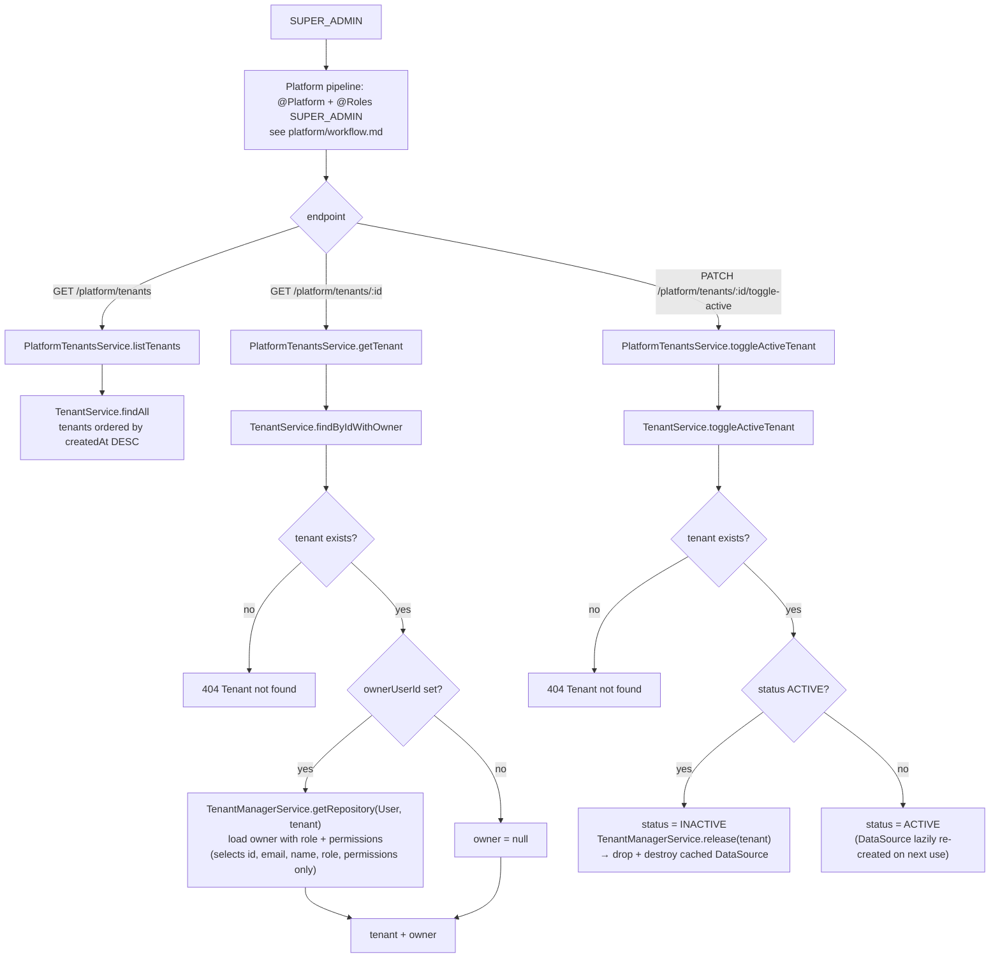

`TenantService.getSchemaSizes()` exists (single `SUM(pg_total_relation_size)` query per schema) but is no longer wired into these platform endpoints: `listTenants` returns the raw `Tenant` rows and `getTenant` returns tenant + owner only. `storageUsedBytes` / `storageCapacityBytes` are maintained incrementally by `TenantService.adjustStorageUsedBytes` during product image upload/delete.
