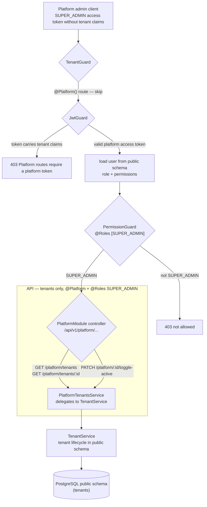

```mermaid
flowchart TD
    Client["Platform admin client<br/>SUPER_ADMIN access token without tenant claims"] --> TG{"TenantGuard"}
    TG -->|"@Platform() route — skip"| JG{"JwtGuard"}
    JG -->|"token carries tenant claims"| E403T["403 Platform routes require a platform token"]
    JG -->|"valid platform access token"| LOAD["load user from public schema<br/>role + permissions"]
    LOAD --> PG{"PermissionGuard<br/>@Roles [SUPER_ADMIN]"}
    PG -->|"not SUPER_ADMIN"| E403R["403 not allowed"]
    PG -->|"SUPER_ADMIN"| CTRL{"PlatformModule controller<br/>/api/v1/platform/..."}

    subgraph API["API — tenants only, @Platform + @Roles SUPER_ADMIN"]
        CTRL -->|"GET /platform/tenants<br/>GET /platform/tenants/:id"| TSVC["PlatformTenantsService<br/>delegates to TenantService"]
        CTRL -->|"PATCH /platform/:id/toggle-active"| TSVC
    end

    TSVC --> CORE["TenantService<br/>tenant lifecycle in public schema"]
    CORE --> PDB[("PostgreSQL public schema<br/>(tenants)")]
```

Platform scope is tenant lifecycle only. Tenant users, roles, and permissions are managed exclusively by tenant admins through the core modules.
