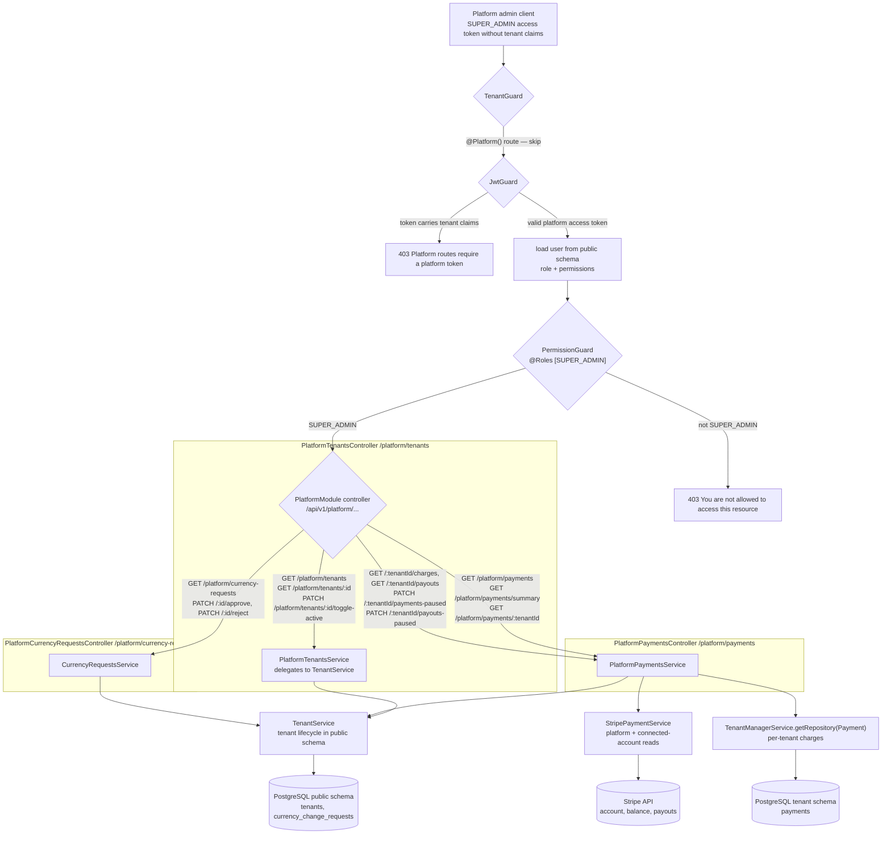

Platform scope is tenant lifecycle, platform-level payment oversight, and currency-change review. Tenant users, roles, permissions, products, carts, orders and addresses remain tenant-admin territory; `PlatformCurrencyRequestsController.approve` is the only platform write that mutates a tenant's live configuration (`tenants.currency`).
