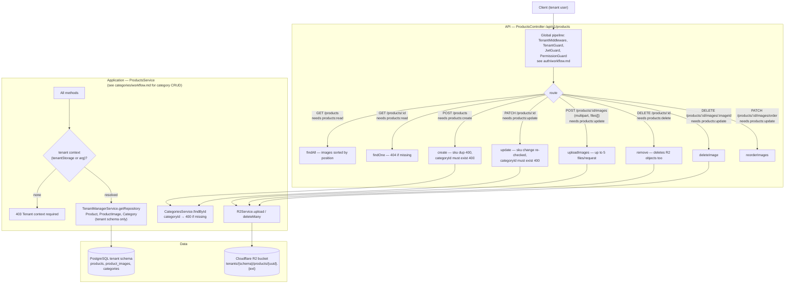
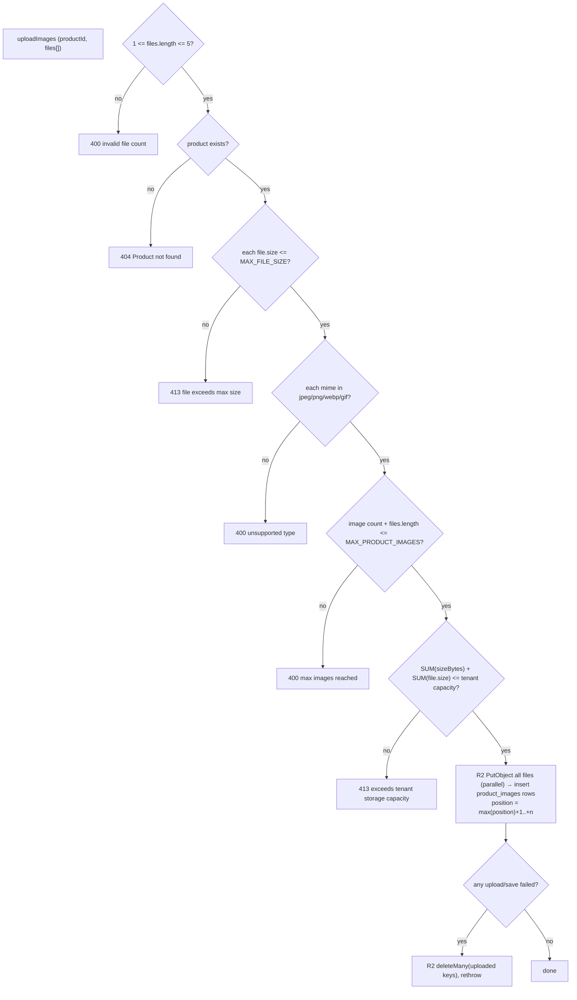
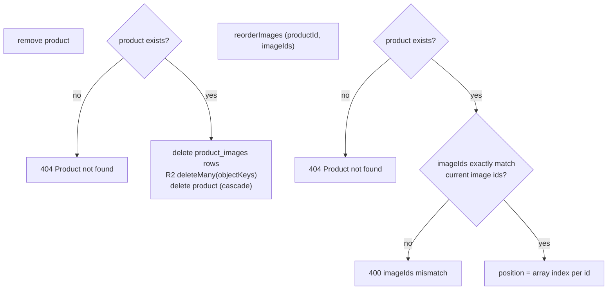

```mermaid
flowchart TD
    Client["Client (tenant user)"] --> GUARDS["Global pipeline: TenantMiddleware, TenantGuard,<br/>JwtGuard, PermissionGuard<br/>see auth/workflow.md"]

    subgraph API["API — ProductsController /api/v1/products"]
        GUARDS --> RO{"route"}
        RO -->|"GET /products<br/>needs products:read"| FA["findAll — images sorted by position"]
        RO -->|"GET /products/:id<br/>needs products:read"| FO["findOne — 404 if missing"]
        RO -->|"POST /products<br/>needs products:create"| CR["create — sku dup 400,<br/>categoryId must exist 400"]
        RO -->|"PATCH /products/:id<br/>needs products:update"| UP["update — sku change re-checked,<br/>categoryId must exist 400"]
        RO -->|"DELETE /products/:id<br/>needs products:delete"| RM["remove — deletes R2 objects too"]
        RO -->|"POST /products/:id/images (multipart, files[])<br/>needs products:update"| UI["uploadImages — up to 5 files/request"]
        RO -->|"DELETE /products/:id/images/:imageId<br/>needs products:update"| DI["deleteImage"]
        RO -->|"PATCH /products/:id/images/order<br/>needs products:update"| RI["reorderImages"]
    end

    subgraph APP["Application — ProductsService<br/>(see categories/workflow.md for category CRUD)"]
        SVC["All methods"] --> TRT{"tenant context<br/>(tenantStorage or arg)?"}
        TRT -->|"none"| TRTE["403 Tenant context required"]
        TRT -->|"resolved"| TM["TenantManagerService.getRepository<br/>Product, ProductImage, Category<br/>(tenant schema only)"]
        CR --> CAT["CategoriesService.findById<br/>categoryId → 400 if missing"]
        UP --> CAT
        UI --> R2S["R2Service.upload / deleteMany"]
        RM --> R2S
        DI --> R2S
    end

    subgraph DATA["Data"]
        TM --> TDB[("PostgreSQL tenant schema<br/>products, product_images, categories")]
        R2S --> R2[("Cloudflare R2 bucket<br/>tenants/{schema}/products/{uuid}.{ext}")]
    end
```

---

```mermaid
flowchart TD
    UPIMG["uploadImages (productId, files[])"]
        U0{"1 <= files.length <= 5?"} -->|"no"| U0E["400 invalid file count"]
        U0 -->|"yes"| U1{"product exists?"} -->|"no"| U1E["404 Product not found"]
        U1 -->|"yes"| U2{"each file.size <= MAX_FILE_SIZE?"} -->|"no"| U2E["413 file exceeds max size"]
        U2 -->|"yes"| U3{"each mime in jpeg/png/webp/gif?"} -->|"no"| U3E["400 unsupported type"]
        U3 -->|"yes"| U4{"image count + files.length <= MAX_PRODUCT_IMAGES?"} -->|"no"| U4E["400 max images reached"]
        U4 -->|"yes"| U5{"SUM(sizeBytes) + SUM(file.size) <= tenant capacity?"} -->|"no"| U5E["413 exceeds tenant storage capacity"]
        U5 -->|"yes"| U6["R2 PutObject all files (parallel) → insert product_images rows<br/>position = max(position)+1..+n"]
        U6 --> U7{"any upload/save failed?"} -->|"yes"| U7E["R2 deleteMany(uploaded keys), rethrow"]
        U7 -->|"no"| U8["done"]
```

---

```mermaid
flowchart TD
    RMIMG["remove product"]
        R1{"product exists?"} -->|"no"| R1E["404 Product not found"]
        R1 -->|"yes"| R2["delete product_images rows<br/>R2 deleteMany(objectKeys)<br/>delete product (cascade)"]

    REORD["reorderImages (productId, imageIds)"]
        O1{"product exists?"} -->|"no"| O1E["404 Product not found"]
        O1 -->|"yes"| O2{"imageIds exactly match<br/>current image ids?"} -->|"no"| O2E["400 imageIds mismatch"]
        O2 -->|"yes"| O3["position = array index per id"]
```
