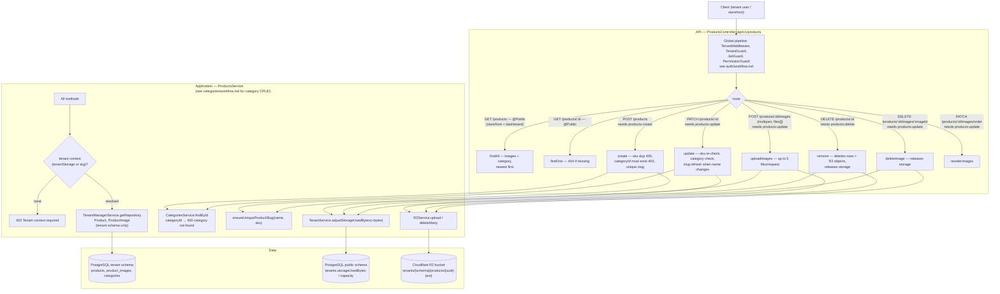
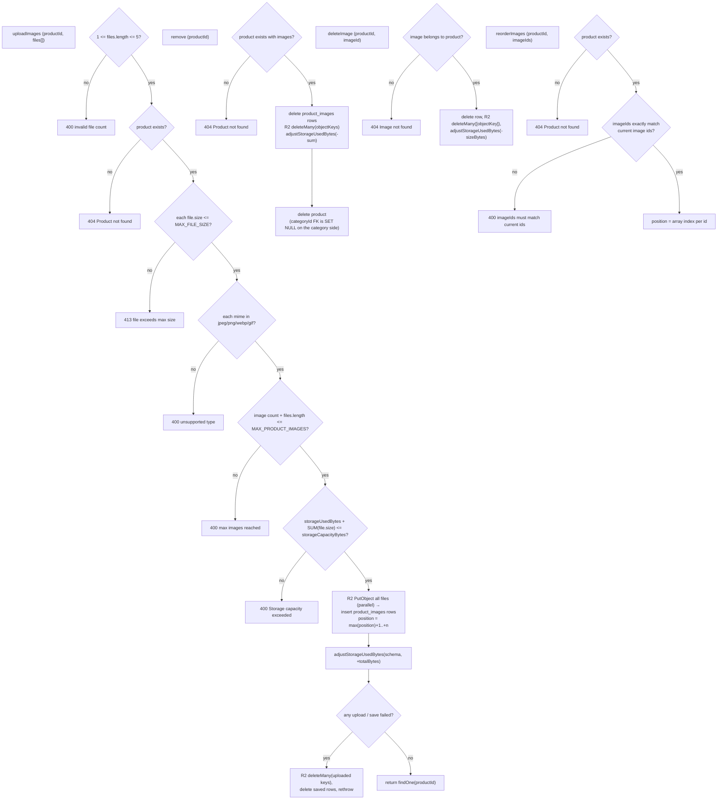

---

Slug rules (`products.slug.ts`): `slugifyProductName(name)` is the base; `ensureUniqueProductSlug` appends a numeric suffix when taken. A slug is generated when the product has none, and refreshed from the name on rename only when the new base slug is free (or owned by the same product). The storefront stores product URLs as `/products/<slug>`.
