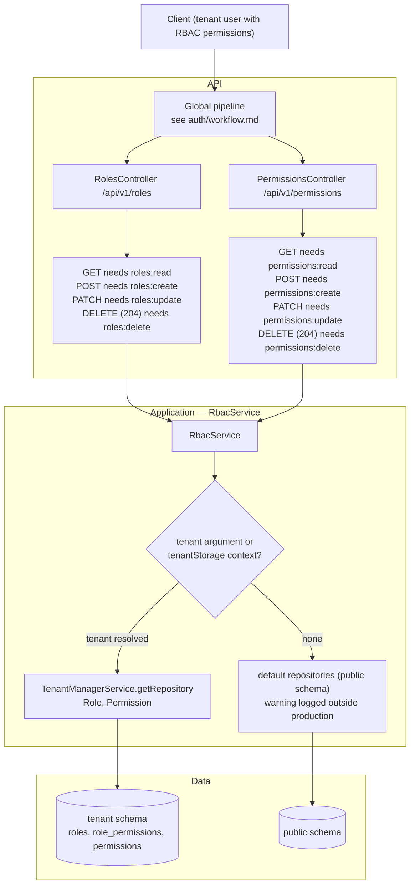
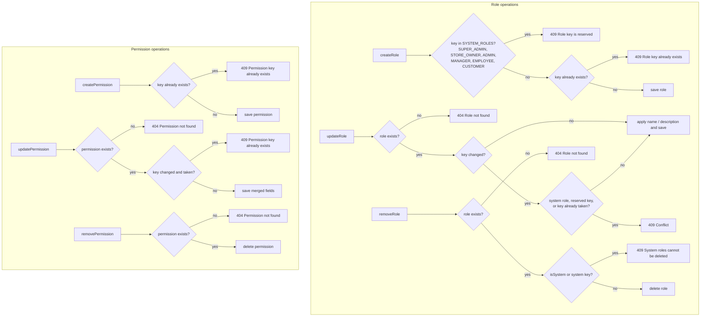
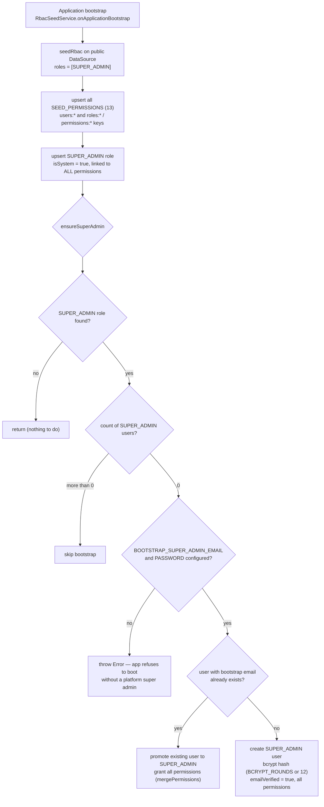

```mermaid
flowchart TD
    Client["Client (tenant user with RBAC permissions)"] --> GUARDS["Global pipeline<br/>see auth/workflow.md"]

    subgraph API["API"]
        GUARDS --> RC["RolesController /api/v1/roles"]
        GUARDS --> PC["PermissionsController /api/v1/permissions"]
        RC --> RC1["GET needs roles:read<br/>POST needs roles:create<br/>PATCH needs roles:update<br/>DELETE (204) needs roles:delete"]
        PC --> PC1["GET needs permissions:read<br/>POST needs permissions:create<br/>PATCH needs permissions:update<br/>DELETE (204) needs permissions:delete"]
    end

    RC1 --> SVC["RbacService"]
    PC1 --> SVC

    subgraph APP["Application — RbacService"]
        SVC --> TRT{"tenant argument or<br/>tenantStorage context?"}
        TRT -->|"tenant resolved"| TM["TenantManagerService.getRepository<br/>Role, Permission"]
        TRT -->|"none"| DEF["default repositories (public schema)<br/>warning logged outside production"]
    end

    subgraph DATA["Data"]
        TM --> TDB[("tenant schema<br/>roles, role_permissions, permissions")]
        DEF --> PDB[("public schema")]
    end
```

```mermaid
flowchart TD
    subgraph RROLE["Role operations"]
        CR["createRole"] --> CR1{"key in SYSTEM_ROLES?<br/>SUPER_ADMIN, STORE_OWNER, ADMIN,<br/>MANAGER, EMPLOYEE, CUSTOMER"}
        CR1 -->|"yes"| CR1E["409 Role key is reserved"]
        CR1 -->|"no"| CR2{"key already exists?"}
        CR2 -->|"yes"| CR2E["409 Role key already exists"]
        CR2 -->|"no"| CR3["save role"]
        UR["updateRole"] --> UR1{"role exists?"} -->|"no"| UR1E["404 Role not found"]
        UR1 -->|"yes"| UR2{"key changed?"}
        UR2 -->|"no"| UR4["apply name / description and save"]
        UR2 -->|"yes"| UR3{"system role, reserved key,<br/>or key already taken?"} -->|"yes"| UR3E["409 Conflict"]
        UR3 -->|"no"| UR4
        DR["removeRole"] --> DR1{"role exists?"} -->|"no"| DR1E["404 Role not found"]
        DR1 -->|"yes"| DR2{"isSystem or system key?"} -->|"yes"| DR2E["409 System roles cannot be deleted"]
        DR2 -->|"no"| DR3["delete role"]
    end

    subgraph RPERM["Permission operations"]
        CP["createPermission"] --> CP1{"key already exists?"} -->|"yes"| CP1E["409 Permission key already exists"]
        CP1 -->|"no"| CP2["save permission"]
        UP["updatePermission"] --> UP1{"permission exists?"} -->|"no"| UP1E["404 Permission not found"]
        UP1 -->|"yes"| UP2{"key changed and taken?"} -->|"yes"| UP2E["409 Permission key already exists"]
        UP2 -->|"no"| UP3["save merged fields"]
        DP["removePermission"] --> DP1{"permission exists?"} -->|"no"| DP1E["404 Permission not found"]
        DP1 -->|"yes"| DP2["delete permission"]
    end
```

```mermaid
flowchart TD
    BOOT["Application bootstrap<br/>RbacSeedService.onApplicationBootstrap"] --> SEED["seedRbac on public DataSource<br/>roles = [SUPER_ADMIN]"]
    SEED --> S1["upsert all SEED_PERMISSIONS (13)<br/>users:* and roles:* / permissions:* keys"]
    S1 --> S2["upsert SUPER_ADMIN role<br/>isSystem = true, linked to ALL permissions"]
    S2 --> E0{"ensureSuperAdmin"}
    E0 --> E1{"SUPER_ADMIN role found?"} -->|"no"| SKIP["return (nothing to do)"]
    E1 -->|"yes"| E2{"count of SUPER_ADMIN users?"}
    E2 -->|"more than 0"| SKIP2["skip bootstrap"]
    E2 -->|"0"| E3{"BOOTSTRAP_SUPER_ADMIN_EMAIL<br/>and PASSWORD configured?"}
    E3 -->|"no"| FAIL["throw Error — app refuses to boot<br/>without a platform super admin"]
    E3 -->|"yes"| E4{"user with bootstrap email<br/>already exists?"}
    E4 -->|"yes"| E5["promote existing user to SUPER_ADMIN<br/>grant all permissions (mergePermissions)"]
    E4 -->|"no"| E6["create SUPER_ADMIN user<br/>bcrypt hash (BCRYPT_ROUNDS or 12)<br/>emailVerified = true, all permissions"]
```
