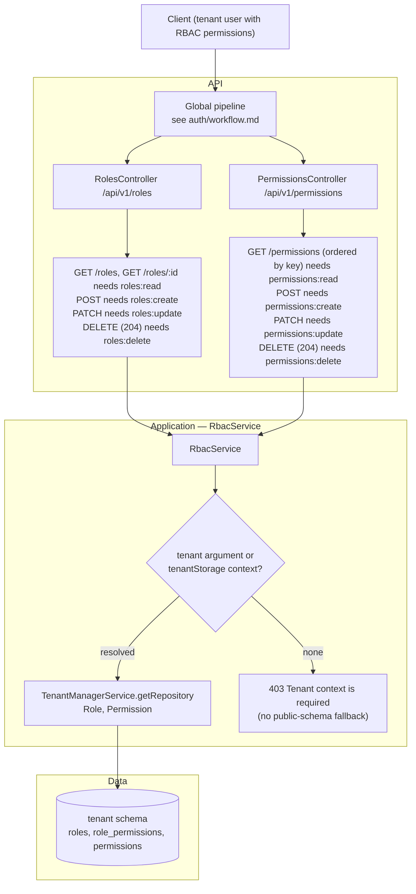
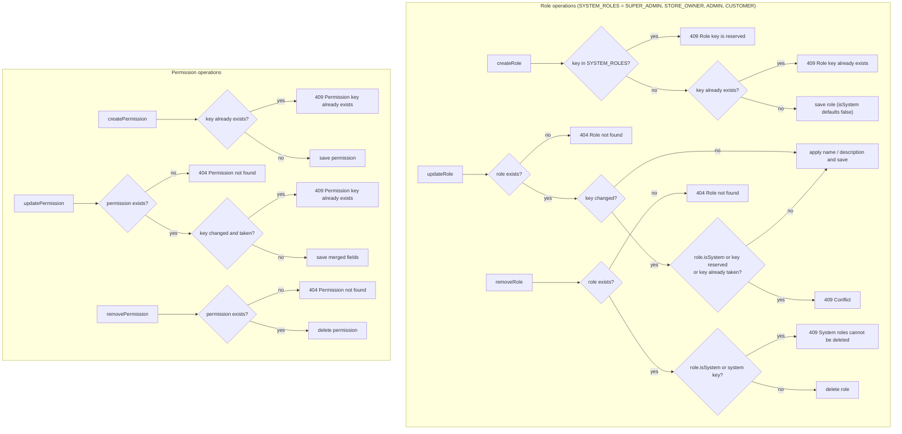
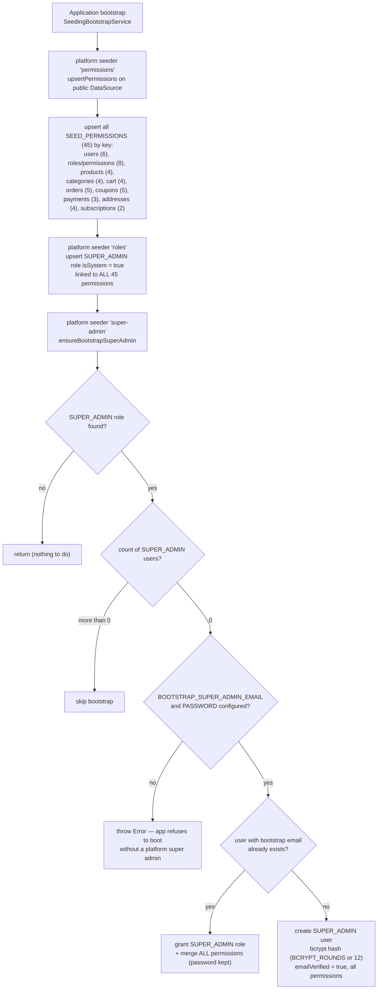
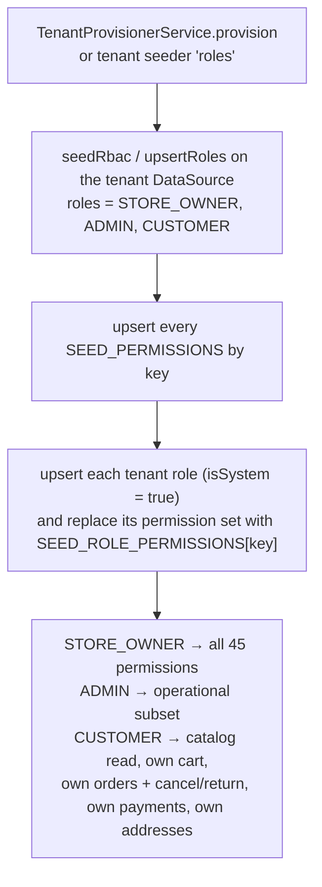

RBAC routes are tenant-scoped only: platform roles/permissions (including `SUPER_ADMIN`) are seeded at bootstrap and are not editable through these controllers.

---

---

Boot seeding is owned by `SeedingBootstrapService` (`src/modules/seeding/`), which runs the
platform seeder registry then the tenant seeder registry for every ACTIVE tenant. It is skipped when
`SEED_CLI=true` so the CLI (`test/seed.ts`) can drive `SeedingService` directly. All RBAC seed logic
lives in `src/modules/seeding/helpers/rbac.seed.ts`.

---

`UsersService.create` and `assignRole` re-attach `SEED_ROLE_PERMISSIONS[roleKey]` as **direct** `user_permissions`; custom roles map to `[]`. Seeding is idempotent and conflict-safe (upsert by unique `key`), so it never deletes tenant-created permissions.
