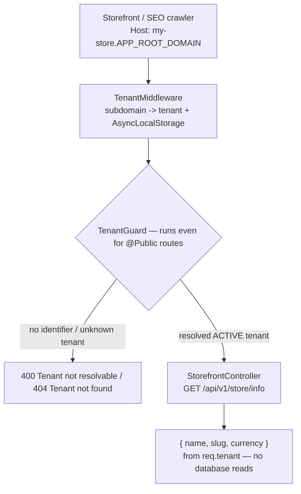
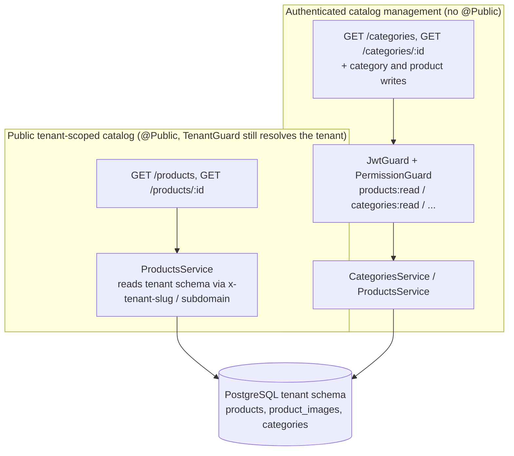

The storefront module itself is intentionally tiny: it exposes only the public, tenant-resolved `GET /store/info` branding endpoint and performs no repository access. The storefront application (`apps/tenant_store`) reads the public product catalog from the products module and resolves branding from this endpoint through its own Next route handlers; browser code never calls the API directly.
