```mermaid
flowchart TD
    subgraph ADMIN["Super Admin (platform) — PlatformSubscriptionPlansController / PlatformTenantSubscriptionController"]
        A0["@Platform() @Roles([SUPER_ADMIN])"] --> A1{"route"}
        A1 -->|"GET /platform/subscription-plans"| L["SubscriptionPlansService.findAll<br/>filter active/isPublic, ordered by sortOrder"]
        A1 -->|"GET /platform/subscription-plans/:id"| F["findOne — 404 PLAN_NOT_FOUND"]
        A1 -->|"POST /platform/subscription-plans"| C["create — validate slug/limits/features,<br/>replace limits + features"]
        A1 -->|"PATCH /platform/subscription-plans/:id"| U["update — full replacement of provided<br/>limits/features sets"]
        A1 -->|"DELETE /platform/subscription-plans/:id"| D["remove — referenced → active=false,<br/>else hard delete (children cascade)"]
        A1 -->|"PUT /platform/tenants/:id/subscription"| P["SubscriptionService.assignPlan —<br/>reject inactive/private, upsert row,<br/>sync Tenant.storageCapacityBytes"]
        A1 -->|"PATCH .../subscription/status"| S["updateStatus — activate/cancel"]
        A1 -->|"GET /platform/tenants/:id/subscription"| GS["getPlanForTenantId — current plan +<br/>subscription (falls back to free plan)"]
        A1 -->|"GET /platform/tenants/:id/subscription/usage"| GU["getUsageSummaryByTenantId —<br/>schema from tenant id, limits by id,<br/>live usage"]
    end

    subgraph TENANT["Tenant — SubscriptionController /api/v1/subscription"]
        T0["JwtGuard + PermissionGuard<br/>subscriptions:read"] --> T1{"route"}
        T1 -->|"GET /subscription"| G["getByTenantRef — own subscription only"]
        T1 -->|"GET /subscription/plans"| PL["findAll({active:true, isPublic:true})"]
        T1 -->|"GET /subscription/usage"| US["SubscriptionUsageService.getUsageSummary"]
        T0 --> CTX["resolveTenantScope() from request context;<br/>client tenantId is rejected by ValidationPipe"]
    end

    subgraph ENFORCE["Limit enforcement (SubscriptionEntitlementsService)"]
        E0["UsersService.create (ADMIN/STORE_OWNER)"] --> EL["SubscriptionService.withTenantLock<br/>pessimistic_write on subscriptions row"]
        EL --> EA["assertCanCreateStoreAdmin — count STORE_OWNER+ADMIN"]
        E1["CouponsService.create"] --> EF["assertCanCreateCoupon (COUPONS feature +<br/>COUPONS_PER_MONTH)"]
        EF --> EC["SubscriptionUsageService.consumeCouponQuota<br/>INSERT ... ON CONFLICT ... WHERE used < limit RETURNING"]
        EC --> ER["releaseCouponQuota on insert failure<br/>(delete does not refund)"]
        E2["ProductsService.create"] --> EP["assertCanCreateProduct —<br/>live count of tenant products vs PRODUCTS limit"]
        E4["OrdersService.checkout"] --> ED["assertCanUseDatabase —<br/>pg_total_relation_size on tenant schema only"]
        E3["ProductsService.uploadImages"] --> ES["TenantService.adjustStorageUsedBytes<br/>against plan-synced storageCapacityBytes"]
    end

    C --> DB[("public schema:<br/>subscription_plans, _limits, _features,<br/>subscriptions, tenant_usage_counters")]
    D --> DB
    P --> DB
    S --> DB
    GS --> DB
    GU --> DB
    G --> DB
    PL --> DB
    EA --> DB
    EC --> DB
    ED --> DB
    EP --> DB
```

Rules:
- All plan/subscription state lives in the **public** schema and is created by TypeORM `synchronize`
  (no migrations). Tenant-scoped code never queries these tables directly — it goes through
  `SubscriptionEntitlementsService`.
- One subscription per tenant (`subscriptions.tenantId` unique). Assigning a plan mirrors the
  plan's `STORAGE_BYTES` into `Tenant.storageCapacityBytes`; unlimited (no row / `value IS NULL`)
  maps to `Number.MAX_SAFE_INTEGER`. Downgrades never throw: usage is preserved and the new limit
  applies immediately.
- States: active = `ACTIVE`; usable = `TRIALING | ACTIVE | PAST_DUE`, plus `CANCELED` until
  `currentPeriodEnd`. Non-usable → `SUBSCRIPTION_INACTIVE`.
- Coupon quota is a durable calendar-month (UTC) counter; the atomic guarded upsert is the
  concurrency guard, and the public subscription row lock additionally serializes admin counting.
- Domain errors are `HttpException` subclasses with a stable `{ code, message }` body.

Seed (`SeedingBootstrapService` via the `subscription-plans` + `subscription-backfill` platform
seeders, helpers in `src/modules/seeding/`):
`free` (500 MB / 50 MB / 1 admin / 5 coupons / 10 products) → `starter` (100 products) →
`growth` (1000 products) → `pro` (5000 products) → `enterprise` (no limit rows = unlimited, all
features). Plans are upserted by `slug` from `constants/subscription-plan-seeds.ts` and their
limits/features are synced to the exact seeded set. Idempotent, then backfills `free` for tenants
without a subscription and re-syncs storage capacity.
