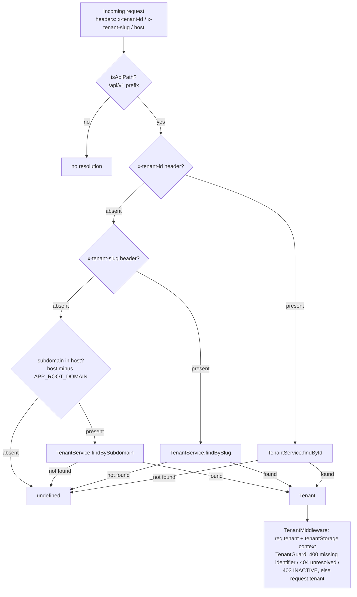
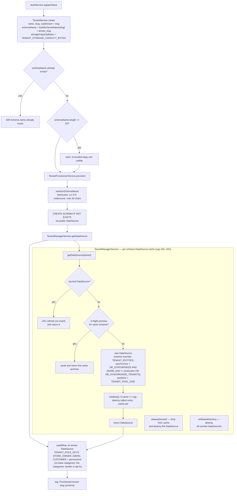
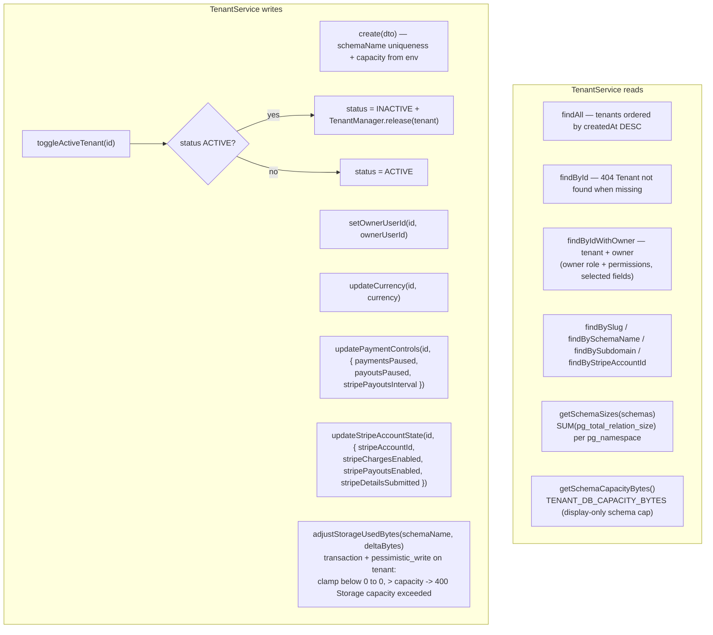

Resolution order is `x-tenant-id` → `x-tenant-slug` → subdomain (`resolveSubdomain`: host stripped of port and `APP_ROOT_DOMAIN`). The `Host` path is what lets tenant dashboards (`my-store.localhost:5174`) and the storefront (`my-store.localhost:3000`) resolve without headers.

---

---

`storageCapacityBytes` is set at tenant creation from `TENANT_STORAGE_CAPACITY_BYTES`; `storageUsedBytes` is then maintained incrementally by `adjustStorageUsedBytes` on every product image upload/delete (never recomputed from `pg_total_relation_size` in normal operation).
