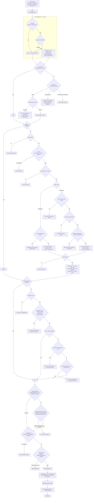

# API request workflow

```mermaid
flowchart TD
    A["Client request<br/>Authorization: Bearer token<br/>x-tenant-id / x-tenant-slug / subdomain Host"] --> B["main.ts<br/>global prefix /api/v1"]

    subgraph MW["TenantMiddleware — all routes"]
        M1{"isApiPath<br/>/api/v1/* or /api/v1-json?"} -->|"no"| MSKIP["next() — no tenant context"]
        M1 -->|"yes"| M2{"resolveFromRequest"}
        M2 -->|"resolved"| M3["req.tenant = tenant<br/>next() inside tenantStorage.run<br/>(AsyncLocalStorage: tenant, tenantSchema)"]
        M2 -->|"none"| MSKIP
    end

    B --> M1
    M3 --> G0
    MSKIP --> G0

    G0{"TenantGuard<br/>@Platform() or non-API?"}
    G0 -->|"yes"| TSKIP["pass"]
    G0 -->|"no"| T1{"req.tenant or resolveFromRequest"}
    T1 -->|"found"| T2{"tenant.status ACTIVE?"}
    T2 -->|"INACTIVE"| T2E["403 Tenant is inactive or suspended.<br/>Please contact the administrator."]
    T2 -->|"ACTIVE"| T3["request.tenant = tenant"]
    T1 -->|"no identifier sent"| T3E["400 Tenant not resolvable:<br/>missing x-tenant-id/x-tenant-slug header or subdomain"]
    T1 -->|"identifier sent, lookup failed"| T3N["404 Tenant not found"]

    T3 --> J0
    TSKIP --> J0

    J0{"JwtGuard<br/>@Public()?"}
    J0 -->|"yes"| JSKIP["skip auth"]
    J0 -->|"no"| J1{"Bearer token?"}
    J1 -->|"no"| J1E["401 No token provided"]
    J1 -->|"yes"| J2{"jwt.verify<br/>access secret + issuer + audience"}
    J2 -->|"invalid/expired"| J2E["401 Invalid token"]
    J2 -->|"valid"| J3{"payload.type == access?"}
    J3 -->|"no"| J3E["401 Unauthorized"]
    J3 -->|"yes"| J4{"Route scope"}
    J4 -->|"@Platform()"| JP0{"Token carries tenant claims?"}
    JP0 -->|"yes"| JPE["403 Platform routes require a platform token"]
    JP0 -->|"no"| JPU["UsersService.findOne — public schema<br/>with role + permissions"]
    J4 -->|"tenant route"| JR0{"Token carries tenant claims?"}
    JR0 -->|"no"| JR0E["403 Tenant-scoped token required"]
    JR0 -->|"yes"| JR1{"Tenant context resolved?"}
    JR1 -->|"no"| JR1E["403 Tenant context is required"]
    JR1 -->|"yes"| JR2{"resolved schemaName == token tenantSchema?"}
    JR2 -->|"no"| JR2E["403 Token does not belong to this tenant"]
    JR2 -->|"yes"| JRT["UsersService.findOne — tenant schema<br/>with role + permissions"]
    JPU --> JU{"User found?"}
    JRT --> JU
    JU -->|"no"| JUE["404 User not found"]
    JU -->|"yes"| JATT["request.user = id, name, email, role<br/>permissions = direct + role (deduped)<br/>request.tenant = resolved tenant"]

    JATT --> P0
    JSKIP --> P0

    P0{"PermissionGuard<br/>@Public()?"}
    P0 -->|"yes"| PSKIP["pass"]
    P0 -->|"no"| P1{"request.user set?"}
    P1 -->|"no"| P1E["403 User not authenticated"]
    P1 -->|"yes"| P2{"@Roles() requires SUPER_ADMIN<br/>and user not SUPER_ADMIN?"}
    P2 -->|"yes"| P2E["403 You are not allowed to access this resource"]
    P2 -->|"no"| P3{"user is SUPER_ADMIN?"}
    P3 -->|"yes"| PSKIP
    P3 -->|"no"| P4{"@Roles() set and role not in list?"}
    P4 -->|"yes"| P4E["403 You are not allowed to access this resource"]
    P4 -->|"no"| P5{"@Permissions() set and user lacks any?"}
    P5 -->|"yes"| P5E["403 You are not allowed to access this resource"]
    P5 -->|"no"| PSKIP

    PSKIP --> SUB0{"SubscriptionGuard<br/>@Public/@Platform or no entitlement metadata?"}
    SUB0 -->|"yes (skip)"| TH0
    SUB0 -->|"no"| SUB1{"@RequireActiveSubscription /<br/>@RequireSubscriptionFeature / @RequireSubscriptionLimit"}
    SUB1 -->|"inactive / feature off / limit reached"| SUBE["400 { code, message }"]
    SUB1 -->|"ok"| TH0

    TH0{"ThrottlerGuard<br/>global 20 req/min; register / login 5/min"}
    TH0 -->|"rate exceeded"| THE["429 Too Many Requests"]
    TH0 -->|"ok"| V0{"ValidationPipe<br/>whitelist + forbidNonWhitelisted + transform"}
    V0 -->|"invalid/unknown field"| V0E["400 Bad Request"]
    V0 -->|"valid"| CTRL["Controller handler"]
    CTRL --> REPO["TenantManagerService.getRepository<br/>(tenant DataSource, LRU-cached per schema)"]
    REPO --> DB[("PostgreSQL tenant schema")]
    DB --> CSI["ClassSerializerInterceptor — strips @Exclude"]
    CSI --> RESP["Response"]
```
