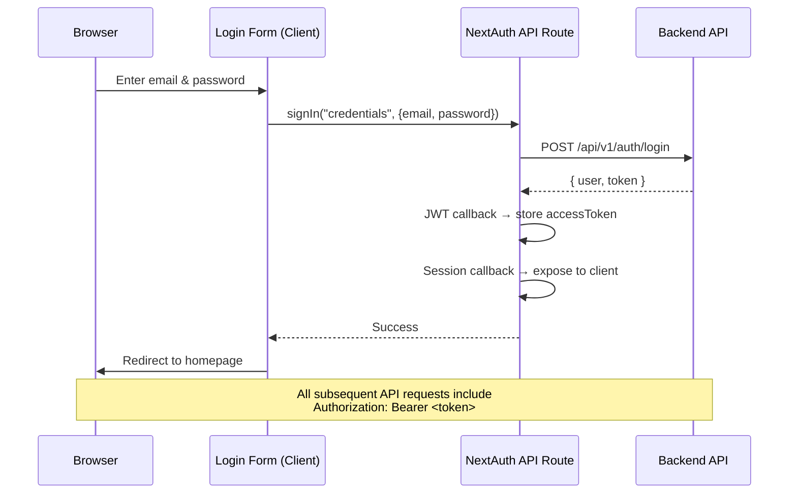

# 🛍️ E-Commerce Store UI

A modern, responsive storefront built with **Next.js 16**, **React 19**, and **Tailwind CSS 4**. Features a complete shopping experience including product browsing, cart management, Stripe checkout, order history, and secure authentication via NextAuth.

---

## 📋 Table of Contents

- [Features](#-features)
- [Tech Stack](#-tech-stack)
- [Architecture](#-architecture)
- [Project Structure](#-project-structure)
- [Getting Started](#-getting-started)
- [Environment Variables](#-environment-variables)
- [Pages & Routes](#-pages--routes)
- [Authentication](#-authentication)
- [API Client Layer](#-api-client-layer)
- [UI Components](#-ui-components)
- [Scripts](#-scripts)

---

## ✨ Features

| Feature | Description |
|---|---|
| 🔐 **Authentication** | Login & register with NextAuth (Credentials provider + JWT strategy) |
| 🛡️ **Route Protection** | Middleware-based auth guard — unauthenticated users redirected to `/login` |
| 🏠 **Homepage** | Product slider showcasing new arrivals via Embla Carousel |
| 🛍️ **Product Catalog** | Browse all products with individual product detail pages |
| ⭐ **Ratings & Reviews** | Interactive star-rating component for product reviews |
| 🛒 **Shopping Cart** | Add/remove items, update quantities, view cart summary |
| 💳 **Stripe Checkout** | Secure payment with Stripe Elements integration |
| 📦 **Order Management** | View order history and order details |
| 🌙 **Dark Mode** | Dark-themed UI with Tailwind CSS |
| 🔔 **Toast Notifications** | User feedback via Sonner toast library |
| 📱 **Responsive Design** | Mobile-friendly layout with container-based responsive design |
| ⚡ **Turbopack** | Fast dev server powered by Next.js Turbopack bundler |
| 🧠 **React Compiler** | Enabled React Compiler for automatic optimizations |

---

## 🛠️ Tech Stack

| Technology | Version | Purpose |
|---|---|---|
| [Next.js](https://nextjs.org/) | 16.2.7 | React framework with App Router + Turbopack |
| [React](https://react.dev/) | 19.2.4 | UI library |
| [TypeScript](https://www.typescriptlang.org/) | 5.x | Type safety |
| [Tailwind CSS](https://tailwindcss.com/) | 4.x | Utility-first CSS |
| [NextAuth](https://next-auth.js.org/) | 4.24.14 | Authentication (Credentials + JWT) |
| [Stripe Elements](https://stripe.com/docs/stripe-js) | 9.x / 6.x | Payment UI components |
| [shadcn/ui](https://ui.shadcn.com/) | 4.x | Accessible, customizable UI component library |
| [Axios](https://axios-http.com/) | 1.17.x | HTTP client for API calls |
| [Embla Carousel](https://www.embla-carousel.com/) | 8.x | Product image carousel |
| [Sonner](https://sonner.emilkowal.dev/) | 2.x | Toast notifications |
| [Lucide React](https://lucide.dev/) | 1.x | Icon library |
| [Remix Icon](https://remixicon.com/) | 4.x | Additional icon library |
| [next-themes](https://github.com/pacocoursey/next-themes) | 0.4.x | Theme management |

### Fonts
- **Noto Sans** — Primary sans-serif font
- **Geist Sans** — Secondary sans-serif font
- **Geist Mono** — Monospace font

---

## 🏛️ Architecture

```
┌──────────────────────────────────────────────────┐
│                  Client Browser                  │
└────────────────────────┬─────────────────────────┘
                         │
          ┌──────────────▼──────────────┐
          │      Next.js 16 App         │
          │    (localhost:3000)          │
          │                             │
          │  ┌────────────────────────┐ │
          │  │    App Router          │ │
          │  │  ┌─ layout.tsx         │ │
          │  │  ├─ page.tsx (Home)    │ │
          │  │  ├─ /login             │ │
          │  │  ├─ /register          │ │
          │  │  ├─ /products          │ │
          │  │  ├─ /products/[id]     │ │
          │  │  ├─ /cart              │ │
          │  │  ├─ /check-out         │ │
          │  │  └─ /orders            │ │
          │  └────────────────────────┘ │
          │                             │
          │  ┌────────────────────────┐ │
          │  │    Middleware           │ │
          │  │  (proxy.ts)            │ │
          │  │  Route protection via  │ │
          │  │  NextAuth withAuth()   │ │
          │  └────────────────────────┘ │
          │                             │
          │  ┌────────────────────────┐ │
          │  │    API Client Layer    │ │
          │  │  (src/api/)            │ │
          │  │  Axios + auto-attach   │ │
          │  │  JWT from session      │ │
          │  └───────────┬────────────┘ │
          └──────────────┼──────────────┘
                         │ HTTP / REST
          ┌──────────────▼──────────────┐
          │   NestJS Backend API        │
          │   (localhost:4000/api/v1)    │
          └─────────────────────────────┘
```

### Key Architectural Decisions

1. **Server & Client Components** — Pages use Next.js server components by default; interactive widgets (forms, carousels, cart actions) are client components
2. **API Proxy Layer** — A configured Axios instance (`apiClient.ts`) auto-attaches the JWT from the NextAuth session on every request, supporting both server-side (`getServerSession`) and client-side (`getSession`) contexts
3. **Middleware Route Protection** — `proxy.ts` enforces the store subdomain, then lets public storefront routes (`/`, `/products`, `/products/<id>`, `/login`, `/register`) through and uses NextAuth's `withAuth` for the rest
4. **Cloudinary Image Support** — `next.config.ts` whitelists Cloudinary, Unsplash, and Pixabay domains for `next/image` optimization

---

## 📁 Project Structure

```
store_ui/
├── src/
│   ├── app/                             # Next.js App Router pages
│   │   ├── layout.tsx                   # Root layout (Providers, NavBar, Toaster)
│   │   ├── globals.css                  # Global styles (Tailwind + custom CSS)
│   │   ├── page.tsx                     # Homepage — new arrivals slider
│   │   ├── login/                       # Login page
│   │   │   ├── page.tsx                 # Server component entry
│   │   │   └── login-form.tsx           # Client component — login form UI
│   │   ├── register/                    # Registration page
│   │   ├── products/                    # Product pages
│   │   │   ├── page.tsx                 # Product listing
│   │   │   └── [productId]/            # Dynamic product detail route
│   │   ├── cart/                        # Shopping cart page
│   │   ├── check-out/                   # Checkout page with Stripe payment
│   │   ├── orders/                      # Order history page
│   │   └── api/auth/[...nextauth]/     # NextAuth route handler
│   │       └── route.ts
│   │
│   ├── components/                      # Reusable UI components
│   │   ├── NavBar.tsx                   # Main navigation bar
│   │   ├── providers.tsx                # SessionProvider wrapper (client component)
│   │   ├── rating.tsx                   # Interactive star rating component
│   │   ├── rating-basic.tsx             # Basic (display-only) star rating
│   │   ├── products/                    # Product-related components
│   │   │   ├── Product_item.tsx         # Product card component
│   │   │   ├── products_slider.jsx      # Product carousel (Embla)
│   │   │   └── AddToCart.tsx            # Add-to-cart button with API call
│   │   ├── cart/                        # Cart-related components
│   │   │   ├── CartItems.tsx            # Cart items list
│   │   │   ├── cartItemCard.tsx         # Individual cart item card
│   │   │   ├── PlaceOrder.tsx           # Place order summary & action
│   │   │   ├── CheckOutForm.tsx         # Checkout form wrapper
│   │   │   ├── PaymentDioalog.tsx       # Stripe payment dialog
│   │   │   └── orderItem.tsx            # Order item display card
│   │   └── ui/                          # shadcn/ui component library
│   │
│   ├── api/                             # API client layer (Axios)
│   │   ├── apiClient.ts                 # Configured Axios instance + JWT interceptor
│   │   ├── authApi.ts                   # Auth API calls (register, etc.)
│   │   ├── productsApi.ts               # Product API calls
│   │   ├── cartApi.ts                   # Cart API calls
│   │   ├── orderApi.ts                  # Order API calls
│   │   ├── userApi.ts                   # User API calls
│   │   └── handelError.ts              # Centralized error handler
│   │
│   ├── lib/                             # Utility libraries
│   │   ├── auth.ts                      # NextAuth configuration (CredentialsProvider)
│   │   └── utils.ts                     # Helper functions (cn, etc.)
│   │
│   ├── types/                           # TypeScript type definitions
│   │   └── next-auth.d.ts               # NextAuth module augmentation (custom token fields)
│   │
│   └── proxy.ts                         # NextAuth middleware (route protection)
│
├── public/                              # Static assets
├── components.json                      # shadcn/ui configuration
├── next.config.ts                       # Next.js configuration (React Compiler, remote images)
├── postcss.config.mjs                   # PostCSS configuration
├── tailwind.config.ts                   # Tailwind CSS configuration (if present)
├── .env.example                         # Environment variable template
├── .env.local                           # Local environment variables (git-ignored)
└── package.json
```

---

## 🚀 Getting Started

### Prerequisites

- **Node.js** ≥ 20
- **pnpm** (recommended) or npm
- The **backend API** running at `http://localhost:4000` (see [backend README](../backend/README.md))
- A **Stripe** account (for the publishable key)

### Installation

```bash
# Navigate to the frontend directory
cd store_ui

# Install dependencies
pnpm install

# Copy and configure environment variables
cp .env.example .env.local
# Edit .env.local with your values (see below)

# Start the development server
pnpm run dev
```

The app will be available at `http://localhost:3000`.

### Subdomain-only storefront

The store is served **per tenant subdomain** — `http://{store-subdomain}.localhost:3000/...`.
Requests to the bare host (`localhost`, `127.0.0.1`, `::1`, or the root domain) render a
**404** page, including `/login` and `/register`, so login always happens on the store's own
subdomain.

Modern browsers resolve `*.localhost` to `127.0.0.1`, so no `hosts` file entry is needed for
local development. Open, for example, `http://demo.localhost:3000/` for the tenant whose slug
is `demo`.

---

## 🔐 Environment Variables

Create a `.env.local` file using `.env.example` as a template:

```env
# NextAuth Configuration
NEXTAUTH_URL=http://localhost:3000
NEXTAUTH_SECRET=your_random_secret_string

# Backend API
NEXT_PUBLIC_BACKEND_URL=http://localhost:4000/api/v1

# Stripe (publishable key — safe for client-side)
NEXT_PUBLIC_STRIPE_PUBLISHABLE_KEY=pk_test_...
```

| Variable | Description | Required |
|---|---|---|
| `NEXTAUTH_URL` | The canonical URL of your frontend app | ✅ |
| `NEXTAUTH_SECRET` | Secret used to sign/encrypt JWTs (generate with `openssl rand -base64 32`) | ✅ |
| `NEXT_PUBLIC_BACKEND_URL` | Full base URL of the NestJS backend API | ✅ |
| `NEXT_PUBLIC_STRIPE_PUBLISHABLE_KEY` | Stripe publishable key for client-side payment forms | ✅ |

---

## 🗺️ Pages & Routes

| Route | Access | Description |
|---|---|---|
| `/` | 🌐 Public | Homepage — new arrivals product slider |
| `/login` | 🌐 Public | Login form (NextAuth credentials) |
| `/register` | 🌐 Public | User registration form |
| `/products` | 🌐 Public | Product catalog listing |
| `/products/[productId]` | 🌐 Public | Product detail page (images, description, add to cart, reviews) |
| `/cart` | 🔒 Protected | Shopping cart with item management |
| `/check-out` | 🔒 Protected | Checkout page with Stripe payment form |
| `/orders` | 🔒 Protected | Order history |

> 🔒 **Protected routes** require authentication. Unauthenticated users are automatically redirected to `/login`.
> 🌐 **Public routes** are tenant-scoped by the request subdomain (the server sends the host-derived tenant to the API), so anonymous catalog browsing stays isolated per store.

---

## 🔑 Authentication

### Flow



### Key Implementation Details

- **Provider**: `CredentialsProvider` — sends `email` + `password` to the backend's `/auth/login` endpoint
- **Strategy**: JWT-based sessions (no database session store)
- **Token Handling**: The backend's access token is stored in the NextAuth JWT and exposed via the session object
- **Auto-attach**: The Axios interceptor in `apiClient.ts` automatically reads the session and attaches the `Authorization: Bearer` header to every API request
- **Type Safety**: `next-auth.d.ts` extends the `User`, `Session`, and `JWT` types to include the custom `accessToken` field
- **Middleware**: `proxy.ts` 404s bare hosts, allows the public storefront routes, and uses `withAuth` to protect the rest

### Public Routes (no auth required)

```
/
/products
/products/<id>
/login
/register
/api/auth/*
/_next/*
/favicon.ico
/robots.txt
/sitemap.xml
```

---

## 🔌 API Client Layer

The `src/api/` directory provides a typed abstraction over the backend API:

### `apiClient.ts` — Core Axios Instance

```typescript
// Auto-configured with:
// - baseURL: NEXT_PUBLIC_BACKEND_URL
// - Content-Type: application/json
// - Request interceptor: auto-attaches JWT from NextAuth session
//   (uses getServerSession on server, getSession on client)
```

### API Modules

| File | Endpoints | Description |
|---|---|---|
| `authApi.ts` | Register | User registration API call |
| `productsApi.ts` | List, Get by ID | Product catalog queries |
| `cartApi.ts` | Get, Add, Update, Remove | Cart management |
| `orderApi.ts` | Create, List, Get | Order operations |
| `userApi.ts` | Profile | User profile queries |
| `handelError.ts` | — | Centralized error extraction from Axios errors |

---

## 🧩 UI Components

### Core Components

| Component | File | Description |
|---|---|---|
| **NavBar** | `NavBar.tsx` | Main navigation with links and auth state |
| **Providers** | `providers.tsx` | Wraps the app in `<SessionProvider>` for NextAuth |
| **Rating** | `rating.tsx` | Interactive star-rating input component |
| **Rating Basic** | `rating-basic.tsx` | Display-only star rating |

### Product Components

| Component | File | Description |
|---|---|---|
| **Product Item** | `Product_item.tsx` | Product card with image, name, price |
| **Products Slider** | `products_slider.jsx` | Embla Carousel of product cards |
| **Add to Cart** | `AddToCart.tsx` | Button that calls the cart API to add a product |

### Cart & Order Components

| Component | File | Description |
|---|---|---|
| **Cart Items** | `CartItems.tsx` | Renders the list of cart items |
| **Cart Item Card** | `cartItemCard.tsx` | Individual cart item with quantity controls |
| **Place Order** | `PlaceOrder.tsx` | Order summary card with place-order action |
| **Checkout Form** | `CheckOutForm.tsx` | Checkout form wrapper |
| **Payment Dialog** | `PaymentDioalog.tsx` | Stripe Elements payment dialog |
| **Order Item** | `orderItem.tsx` | Order item display with status and details |

### shadcn/ui Components

Pre-configured shadcn/ui components are stored in `components/ui/`. Configuration is managed via `components.json`.

---

## 📜 Scripts

| Script | Command | Description |
|---|---|---|
| `dev` | `pnpm run dev` | Start dev server with Turbopack |
| `build` | `pnpm run build` | Build for production |
| `start` | `pnpm run start` | Start production server |
| `lint` | `pnpm run lint` | Run ESLint |

---

## 🖼️ Remote Image Domains

The following external image domains are whitelisted in `next.config.ts` for `next/image`:

- `images.unsplash.com` — Unsplash stock photos
- `cdn.pixabay.com` — Pixabay stock photos
- `res.cloudinary.com` — Cloudinary CDN (product images)

---

## 📄 License

This project is private — see the root [README](../README.md) for details.
