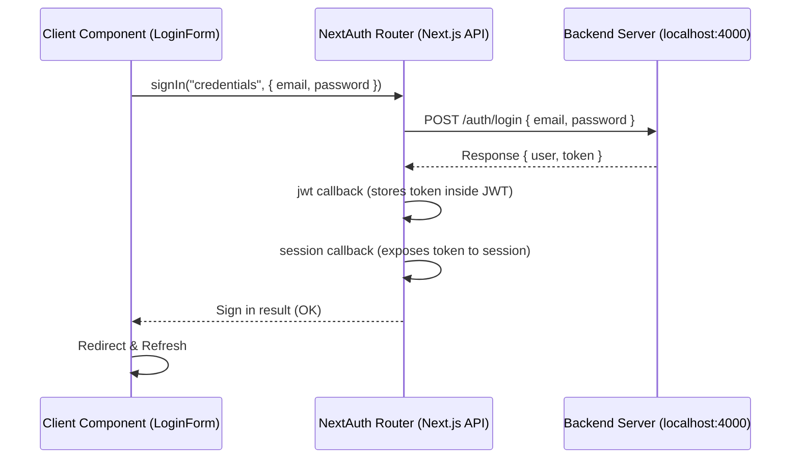

# Project Memory: NextAuth Integration

This document details the configuration and architecture of the NextAuth implementation within this project, serving as a permanent memory for future developers and agents.

## Overview

- **Framework:** Next.js 16.2.7 (App Router, Turbopack)
- **Package Manager:** `pnpm`
- **Auth Library:** `next-auth` (v4.24.14)
- **Session Strategy:** JSON Web Token (JWT)
- **Backend Base URL:** `http://localhost:4000`

---

## Environment Configuration

The application uses the following configuration in [`.env.local`](file:///c:/works/store_ui/.env.local):

- `NEXTAUTH_URL`: `http://localhost:3000` (frontend local port)
- `NEXTAUTH_SECRET`: Secure cryptographic token for signing JWTs
- `NEXT_PUBLIC_BACKEND_URL`: `http://localhost:4000` (target API host)

---

## File Structure & Implementations

### 1. Types Extension

- **File:** [`src/types/next-auth.d.ts`](file:///c:/works/store_ui/src/types/next-auth.d.ts)
- **Details:** Overrides NextAuth's `User`, `Session`, and `JWT` module definitions to support a custom `accessToken` string and custom user ID forwarding. This prevents TypeScript compilation errors when retrieving token data client-side.

### 2. Core Auth Options

- **File:** [`src/lib/auth.ts`](file:///c:/works/store_ui/src/lib/auth.ts)
- **Details:** Sets up `CredentialsProvider`.
  - Sends a `POST` request to `${NEXT_PUBLIC_BACKEND_URL}/auth/login` containing `{ email, password }`.
  - Normalizes multiple backend JSON structures (supports `data.token`, `data.accessToken`, `data.user`, or flat responses).
  - Uses `callbacks.jwt` to append `accessToken` and `id` to the token.
  - Uses `callbacks.session` to map the custom token data to the frontend's session object.
  - Declares the custom sign-in page to reside at `/login`.

### 3. Dynamic Router Handler

- **File:** [`src/app/api/auth/[...nextauth]/route.ts`](file:///c:/works/store_ui/src/app/api/auth/[...nextauth]/route.ts)
- **Details:** Binds the NextAuth configuration to GET and POST methods, serving authentication requests under the Next.js App Router structure.

### 4. Client Session Wrapper

- **File:** [`src/components/providers.tsx`](file:///c:/works/store_ui/src/components/providers.tsx)
- **Details:** A client-side component exporting `<Providers>` wrapping children in `<SessionProvider>`. Allows custom global hooks (`useSession`) to operate on child nodes.
- **Integration:** Imported and mounted inside the global layout file [`src/app/layout.tsx`](file:///c:/works/store_ui/src/app/layout.tsx).

### 5. Custom Login Screen

- **File:** [`src/app/login/page.tsx`](file:///c:/works/store_ui/src/app/login/page.tsx) (Server entry) and [`src/app/login/login-form.tsx`](file:///c:/works/store_ui/src/app/login/login-form.tsx) (Client form).
- **Details:** Displays a modern glassmorphic card design. Implements validation, loading animations, custom inline SVGs, and programmatically triggers NextAuth's `signIn` function.

### 6. Interactive Homepage Dashboard

- **File:** [`src/app/page.tsx`](file:///c:/works/store_ui/src/app/page.tsx)
- **Details:** Shows a landing hero with navigation items if unauthorized. On successful authentication, swaps the UI for a sleek administration dashboard showing dummy stats, profile summaries, and a clipboard copyable token inspector.

---

## Authentication Flow Diagram

