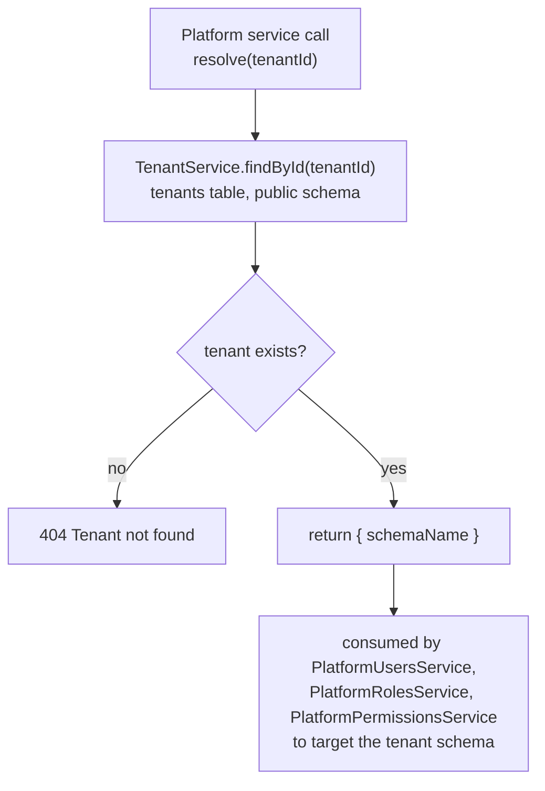

```mermaid
flowchart TD
    CALL["Platform service call<br/>resolve(tenantId)"] --> FIND["TenantService.findById(tenantId)<br/>tenants table, public schema"]
    FIND --> F1{"tenant exists?"}
    F1 -->|"no"| E404["404 Tenant not found"]
    F1 -->|"yes"| REF["return { schemaName }"]
    REF --> USE["consumed by PlatformUsersService,<br/>PlatformRolesService, PlatformPermissionsService<br/>to target the tenant schema"]
```
