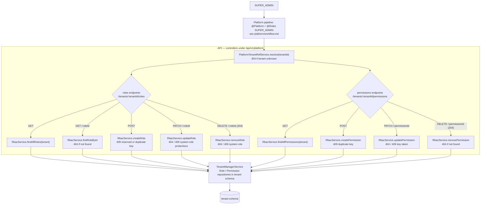

```mermaid
flowchart TD
    Client["SUPER_ADMIN"] --> GUARD["Platform pipeline: @Platform + @Roles SUPER_ADMIN<br/>see platform/workflow.md"]
    GUARD --> REF["PlatformTenantRefService.resolve(tenantId)<br/>404 if tenant unknown"]

    subgraph API["API — controllers under /api/v1/platform"]
        REF --> ROP{"roles endpoints<br/>/tenants/:tenantId/roles"}
        ROP -->|"GET"| RL["RbacService.findAllRoles(tenant)"]
        ROP -->|"GET /:roleId"| RG["RbacService.findRoleById<br/>404 if not found"]
        ROP -->|"POST"| RC["RbacService.createRole<br/>409 reserved or duplicate key"]
        ROP -->|"PATCH /:roleId"| RU["RbacService.updateRole<br/>404 / 409 system-role protections"]
        ROP -->|"DELETE /:roleId (204)"| RD["RbacService.removeRole<br/>404 / 409 system role"]
        REF --> POP{"permissions endpoints<br/>/tenants/:tenantId/permissions"}
        POP -->|"GET"| PL["RbacService.findAllPermissions(tenant)"]
        POP -->|"POST"| PC["RbacService.createPermission<br/>409 duplicate key"]
        POP -->|"PATCH /:permissionId"| PU["RbacService.updatePermission<br/>404 / 409 key taken"]
        POP -->|"DELETE /:permissionId (204)"| PD["RbacService.removePermission<br/>404 if not found"]
    end

    RL --> TM
    RG --> TM
    RC --> TM
    RU --> TM
    RD --> TM
    PL --> TM
    PC --> TM
    PU --> TM
    PD --> TM
    TM["TenantManagerService<br/>Role / Permission repositories in tenant schema"]
    TM --> DB[("tenant schema")]
```
