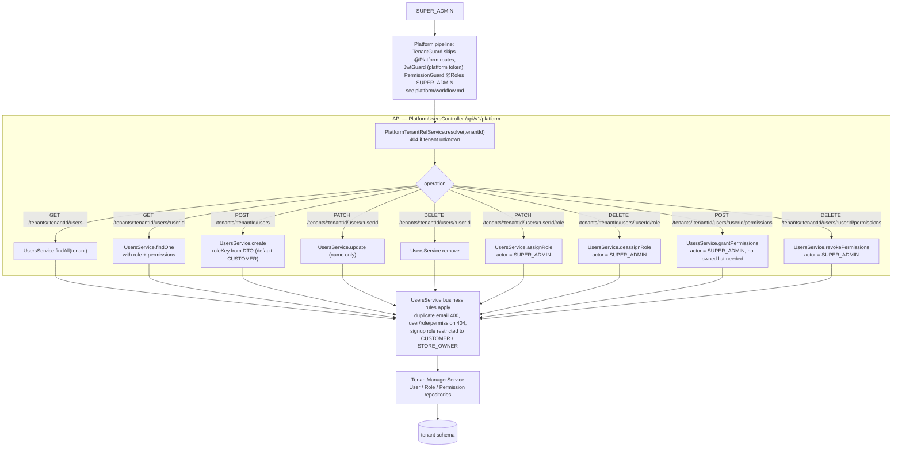

```mermaid
flowchart TD
    Client["SUPER_ADMIN"] --> GUARD["Platform pipeline: TenantGuard skips @Platform routes,<br/>JwtGuard (platform token), PermissionGuard @Roles SUPER_ADMIN<br/>see platform/workflow.md"]
    GUARD --> REF["PlatformTenantRefService.resolve(tenantId)<br/>404 if tenant unknown"]

    subgraph API["API — PlatformUsersController /api/v1/platform"]
        REF --> OP{"operation"}
        OP -->|"GET /tenants/:tenantId/users"| L["UsersService.findAll(tenant)"]
        OP -->|"GET /tenants/:tenantId/users/:userId"| G["UsersService.findOne<br/>with role + permissions"]
        OP -->|"POST /tenants/:tenantId/users"| C["UsersService.create<br/>roleKey from DTO (default CUSTOMER)"]
        OP -->|"PATCH /tenants/:tenantId/users/:userId"| U["UsersService.update (name only)"]
        OP -->|"DELETE /tenants/:tenantId/users/:userId"| D["UsersService.remove"]
        OP -->|"PATCH /tenants/:tenantId/users/:userId/role"| A["UsersService.assignRole<br/>actor = SUPER_ADMIN"]
        OP -->|"DELETE /tenants/:tenantId/users/:userId/role"| AN["UsersService.deassignRole<br/>actor = SUPER_ADMIN"]
        OP -->|"POST /tenants/:tenantId/users/:userId/permissions"| P["UsersService.grantPermissions<br/>actor = SUPER_ADMIN, no owned list needed"]
        OP -->|"DELETE /tenants/:tenantId/users/:userId/permissions"| PN["UsersService.revokePermissions<br/>actor = SUPER_ADMIN"]
    end

    L --> RULES
    G --> RULES
    C --> RULES
    U --> RULES
    D --> RULES
    A --> RULES
    AN --> RULES
    P --> RULES
    PN --> RULES
    RULES["UsersService business rules apply<br/>duplicate email 400, user/role/permission 404,<br/>signup role restricted to CUSTOMER / STORE_OWNER"]
    RULES --> TM["TenantManagerService<br/>User / Role / Permission repositories"]
    TM --> DB[("tenant schema")]
```
