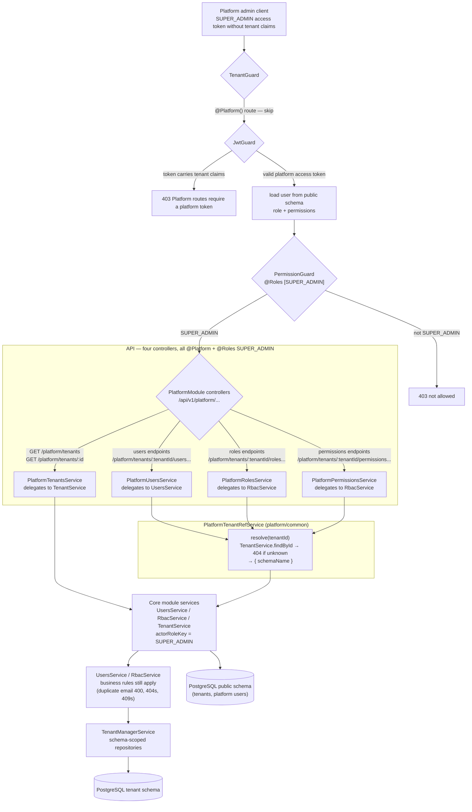

```mermaid
flowchart TD
    Client["Platform admin client<br/>SUPER_ADMIN access token without tenant claims"] --> TG{"TenantGuard"}
    TG -->|"@Platform() route — skip"| JG{"JwtGuard"}
    JG -->|"token carries tenant claims"| E403T["403 Platform routes require a platform token"]
    JG -->|"valid platform access token"| LOAD["load user from public schema<br/>role + permissions"]
    LOAD --> PG{"PermissionGuard<br/>@Roles [SUPER_ADMIN]"}
    PG -->|"not SUPER_ADMIN"| E403R["403 not allowed"]
    PG -->|"SUPER_ADMIN"| CTRL{"PlatformModule controllers<br/>/api/v1/platform/..."}

    subgraph API["API — four controllers, all @Platform + @Roles SUPER_ADMIN"]
        CTRL -->|"GET /platform/tenants<br/>GET /platform/tenants/:id"| TSVC["PlatformTenantsService<br/>delegates to TenantService"]
        CTRL -->|"users endpoints<br/>/platform/tenants/:tenantId/users..."| USVC["PlatformUsersService<br/>delegates to UsersService"]
        CTRL -->|"roles endpoints<br/>/platform/tenants/:tenantId/roles..."| RSVC["PlatformRolesService<br/>delegates to RbacService"]
        CTRL -->|"permissions endpoints<br/>/platform/tenants/:tenantId/permissions..."| PSVC["PlatformPermissionsService<br/>delegates to RbacService"]
    end

    USVC --> REF
    RSVC --> REF
    PSVC --> REF
    subgraph COMMON["PlatformTenantRefService (platform/common)"]
        REF["resolve(tenantId)<br/>TenantService.findById → 404 if unknown<br/>→ { schemaName }"]
    end

    TSVC --> CORE
    REF --> CORE["Core module services<br/>UsersService / RbacService / TenantService<br/>actorRoleKey = SUPER_ADMIN"]
    CORE --> RULES["UsersService / RbacService<br/>business rules still apply<br/>(duplicate email 400, 404s, 409s)"]
    RULES --> TM["TenantManagerService<br/>schema-scoped repositories"]
    TM --> TDB[("PostgreSQL tenant schema")]
    CORE --> PDB[("PostgreSQL public schema<br/>(tenants, platform users)")]
```
