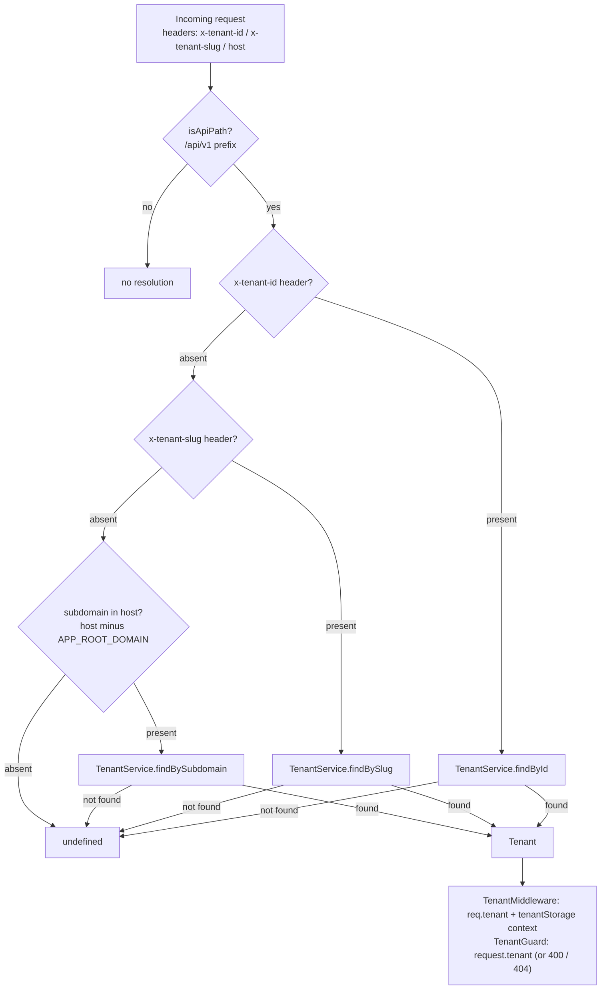
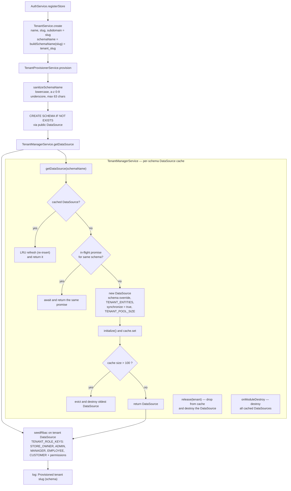
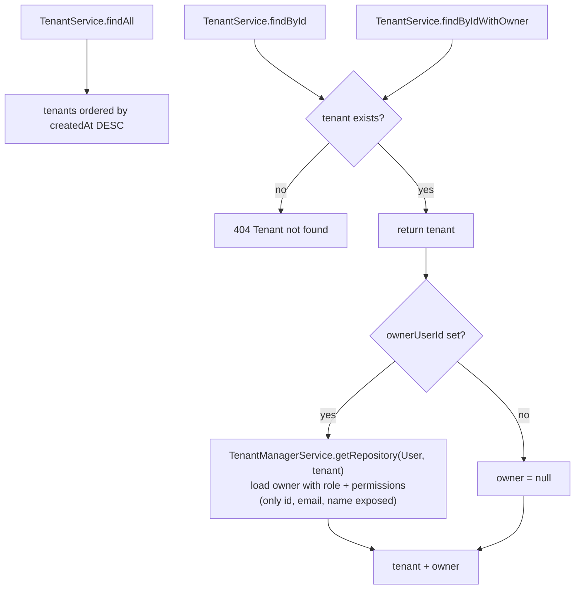

```mermaid
flowchart TD
    REQ["Incoming request<br/>headers: x-tenant-id / x-tenant-slug / host"] --> ISRQ{"isApiPath?<br/>/api/v1 prefix"}
    ISRQ -->|"no"| NONE["no resolution"]
    ISRQ -->|"yes"| HID{"x-tenant-id header?"}
    HID -->|"present"| BYID["TenantService.findById"]
    BYID -->|"not found"| UNDEF["undefined"]
    BYID -->|"found"| TEN["Tenant"]
    HID -->|"absent"| HSL{"x-tenant-slug header?"}
    HSL -->|"present"| BYSLUG["TenantService.findBySlug"]
    BYSLUG -->|"not found"| UNDEF
    BYSLUG -->|"found"| TEN
    HSL -->|"absent"| SUB{"subdomain in host?<br/>host minus APP_ROOT_DOMAIN"}
    SUB -->|"present"| BYSUB["TenantService.findBySubdomain"]
    BYSUB -->|"not found"| UNDEF
    BYSUB -->|"found"| TEN
    SUB -->|"absent"| UNDEF
    TEN --> OUT["TenantMiddleware: req.tenant + tenantStorage context<br/>TenantGuard: request.tenant (or 400 / 404)"]
```

```mermaid
flowchart TD
    REG["AuthService.registerStore"] --> TC["TenantService.create<br/>name, slug, subdomain = slug<br/>schemaName = buildSchemaName(slug) = tenant_slug"]
    TC --> PROV["TenantProvisionerService.provision"]
    PROV --> SAN["sanitizeSchemaName<br/>lowercase, a-z 0-9 underscore, max 63 chars"]
    SAN --> DDL["CREATE SCHEMA IF NOT EXISTS<br/>via public DataSource"]
    DDL --> GDS["TenantManagerService.getDataSource"]
    GDS --> SEED["seedRbac on tenant DataSource<br/>TENANT_ROLE_KEYS: STORE_OWNER, ADMIN,<br/>MANAGER, EMPLOYEE, CUSTOMER + permissions"]
    SEED --> DONE["log: Provisioned tenant slug (schema)"]

    subgraph MGR["TenantManagerService — per-schema DataSource cache"]
        GA["getDataSource(schemaName)"] --> CH{"cached DataSource?"}
        CH -->|"yes"| REFRESH["LRU refresh (re-insert)<br/>and return it"]
        CH -->|"no"| INF{"in-flight promise<br/>for same schema?"}
        INF -->|"yes"| WAIT["await and return the same promise"]
        INF -->|"no"| NEW["new DataSource<br/>schema override, TENANT_ENTITIES,<br/>synchronize = true, TENANT_POOL_SIZE"]
        NEW --> INIT["initialize() and cache.set"]
        INIT --> EVICT{"cache size > 100 ?"}
        EVICT -->|"yes"| EVD["evict and destroy oldest DataSource"]
        EVICT -->|"no"| RET["return DataSource"]
        REL["release(tenant) — drop from cache<br/>and destroy the DataSource"]
        DEST["onModuleDestroy — destroy<br/>all cached DataSources"]
    end

    GDS --> GA
    RET --> SEED
```

```mermaid
flowchart TD
    LIST["TenantService.findAll"] --> L1["tenants ordered by createdAt DESC"]
    GETID["TenantService.findById"] --> G1{"tenant exists?"}
    G1 -->|"no"| G1E["404 Tenant not found"]
    G1 -->|"yes"| G2["return tenant"]
    GETOWN["TenantService.findByIdWithOwner"] --> G1
    G2 --> OW1{"ownerUserId set?"}
    OW1 -->|"yes"| OW2["TenantManagerService.getRepository(User, tenant)<br/>load owner with role + permissions<br/>(only id, email, name exposed)"]
    OW1 -->|"no"| OW3["owner = null"]
    OW2 --> OUT["tenant + owner"]
    OW3 --> OUT
```
