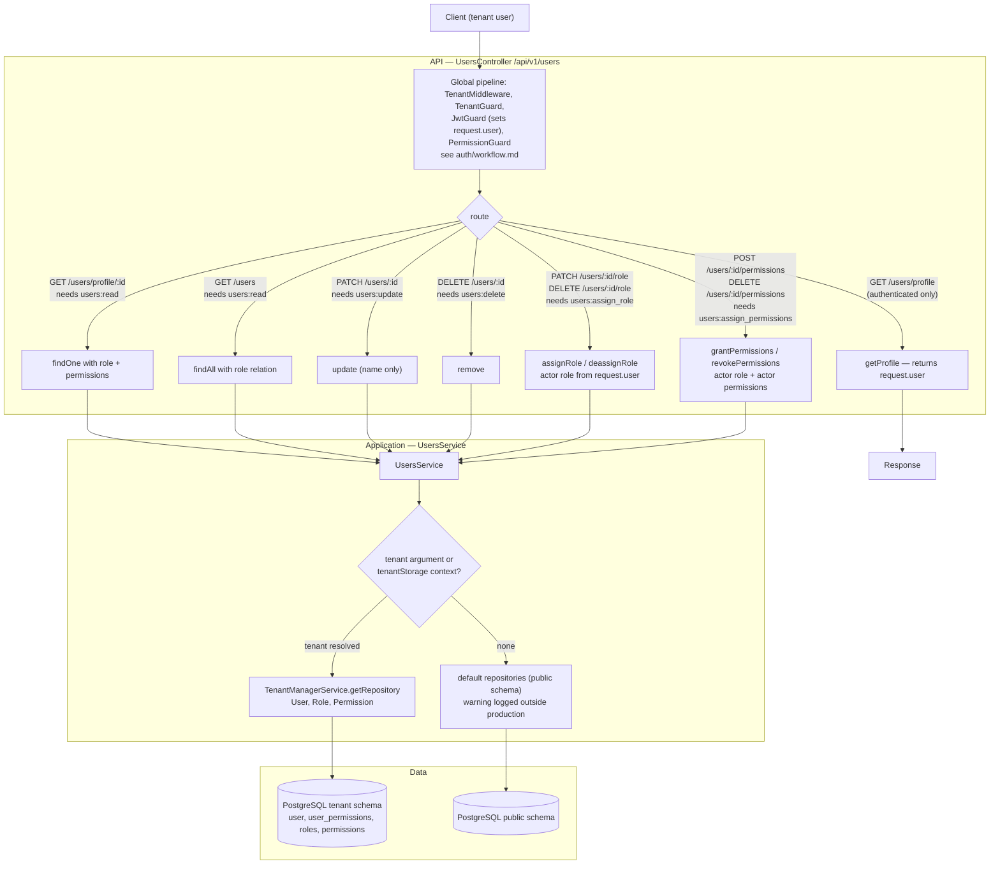
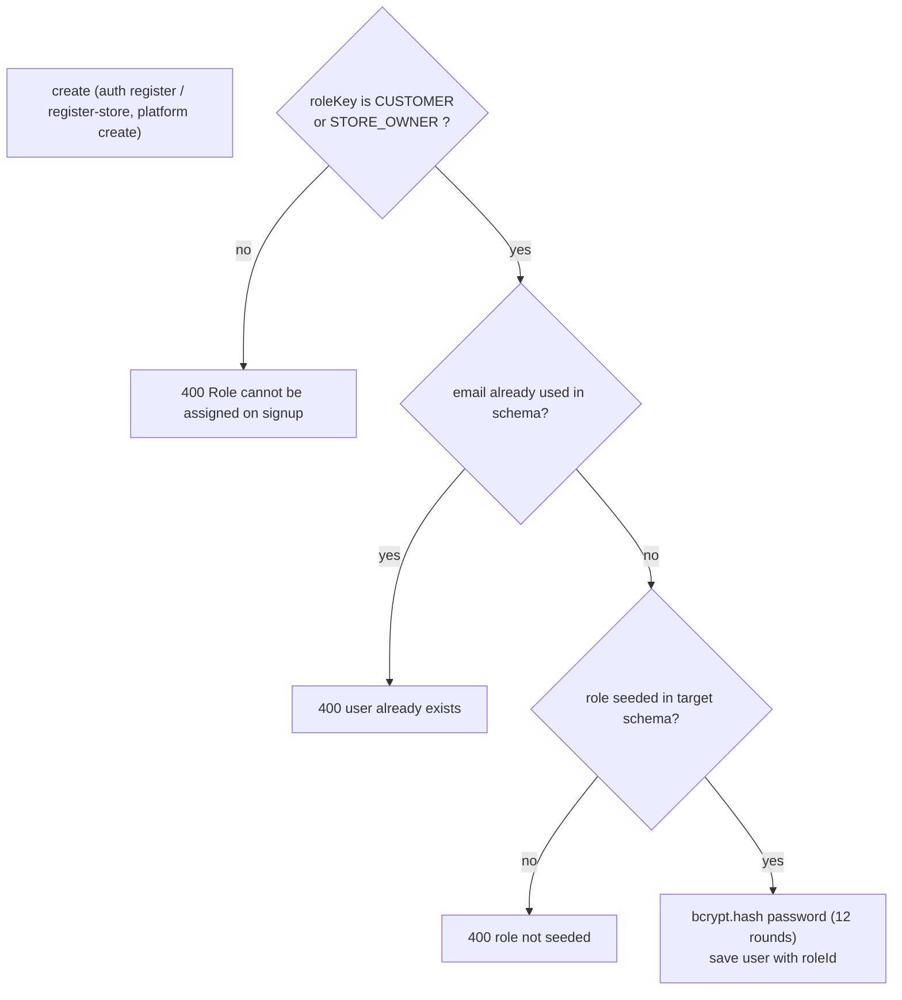
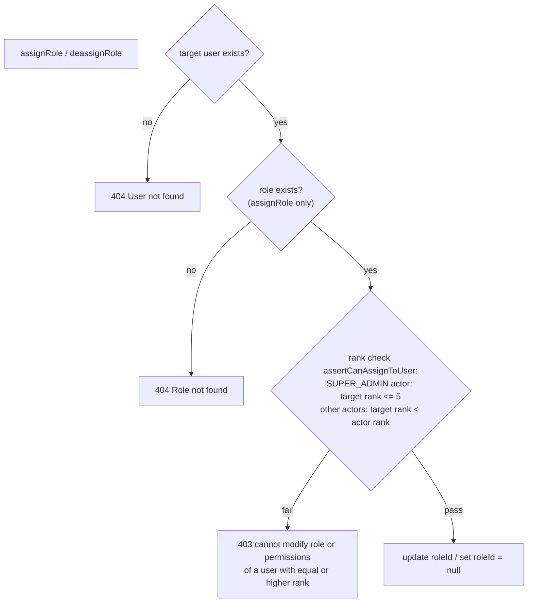
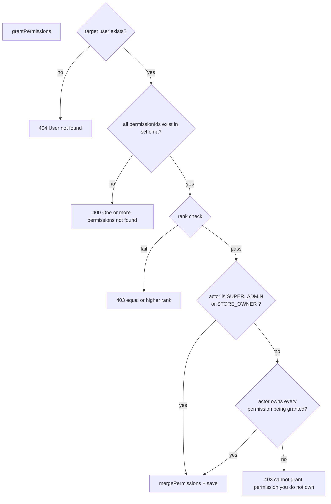
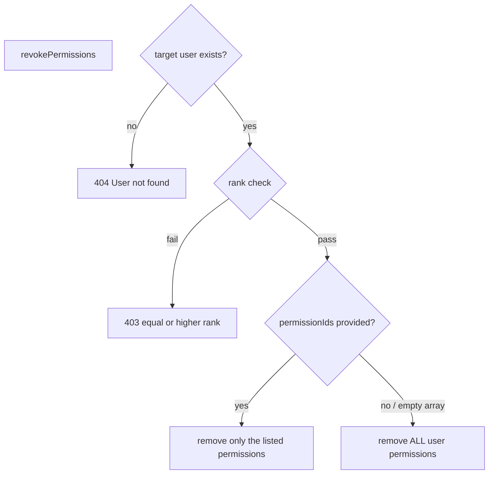

```mermaid
flowchart TD
    Client["Client (tenant user)"] --> GUARDS["Global pipeline: TenantMiddleware, TenantGuard,<br/>JwtGuard (sets request.user), PermissionGuard<br/>see auth/workflow.md"]

    subgraph API["API — UsersController /api/v1/users"]
        GUARDS --> RO{"route"}
        RO -->|"GET /users/profile<br/>(authenticated only)"| PR["getProfile — returns request.user"]
        RO -->|"GET /users/profile/:id<br/>needs users:read"| FO["findOne with role + permissions"]
        RO -->|"GET /users<br/>needs users:read"| FA["findAll with role relation"]
        RO -->|"PATCH /users/:id<br/>needs users:update"| UP["update (name only)"]
        RO -->|"DELETE /users/:id<br/>needs users:delete"| RM["remove"]
        RO -->|"PATCH /users/:id/role<br/>DELETE /users/:id/role<br/>needs users:assign_role"| AR["assignRole / deassignRole<br/>actor role from request.user"]
        RO -->|"POST /users/:id/permissions<br/>DELETE /users/:id/permissions<br/>needs users:assign_permissions"| GP["grantPermissions / revokePermissions<br/>actor role + actor permissions"]
    end

    PR --> RESP["Response"]
    FO --> SVC["UsersService"]
    FA --> SVC
    UP --> SVC
    RM --> SVC
    AR --> SVC
    GP --> SVC

    subgraph APP["Application — UsersService"]
        SVC --> TRT{"tenant argument or<br/>tenantStorage context?"}
        TRT -->|"tenant resolved"| TM["TenantManagerService.getRepository<br/>User, Role, Permission"]
        TRT -->|"none"| DEF["default repositories (public schema)<br/>warning logged outside production"]
    end

    subgraph DATA["Data"]
        TM --> TDB[("PostgreSQL tenant schema<br/>user, user_permissions, roles, permissions")]
        DEF --> PDB[("PostgreSQL public schema")]
    end
```

---

```mermaid
flowchart TD
CREATE["create (auth register / register-store, platform create)"]
        C1{"roleKey is CUSTOMER<br/>or STORE_OWNER ?"} -->|"no"| C1E["400 Role cannot be assigned on signup"]
        C1 -->|"yes"| C2{"email already used in schema?"}
        C2 -->|"yes"| C2E["400 user already exists"]
        C2 -->|"no"| C3{"role seeded in target schema?"}
        C3 -->|"no"| C3E["400 role not seeded"]
        C3 -->|"yes"| C4["bcrypt.hash password (12 rounds)<br/>save user with roleId"]
```

---

```mermaid
flowchart TD
ROLE["assignRole / deassignRole"]
        A1{"target user exists?"} -->|"no"| A1E["404 User not found"]
        A1 -->|"yes"| A2{"role exists?<br/>(assignRole only)"} -->|"no"| A2E["404 Role not found"]
        A2 -->|"yes"| A3{"rank check assertCanAssignToUser:<br/>SUPER_ADMIN actor: target rank <= 5<br/>other actors: target rank < actor rank"}
        A3 -->|"fail"| A3E["403 cannot modify role or permissions<br/>of a user with equal or higher rank"]
        A3 -->|"pass"| A4["update roleId / set roleId = null"]
```

---

```mermaid
flowchart TD
GRANT["grantPermissions"]
        G1{"target user exists?"} -->|"no"| G1E["404 User not found"]
        G1 -->|"yes"| G2{"all permissionIds exist in schema?"}
        G2 -->|"no"| G2E["400 One or more permissions not found"]
        G2 -->|"yes"| G3{"rank check"} -->|"fail"| G3E["403 equal or higher rank"]
        G3 -->|"pass"| G4{"actor is SUPER_ADMIN<br/>or STORE_OWNER ?"}
        G4 -->|"yes"| G6["mergePermissions + save"]
        G4 -->|"no"| G5{"actor owns every<br/>permission being granted?"}
        G5 -->|"no"| G5E["403 cannot grant permission you do not own"]
        G5 -->|"yes"| G6
```

---

```mermaid
flowchart TD

     REVOKE["revokePermissions"]
        V1{"target user exists?"} -->|"no"| V1E["404 User not found"]
        V1 -->|"yes"| V2{"rank check"} -->|"fail"| V2E["403 equal or higher rank"]
        V2 -->|"pass"| V3{"permissionIds provided?"}
        V3 -->|"yes"| V4["remove only the listed permissions"]
        V3 -->|"no / empty array"| V5["remove ALL user permissions"]

```
